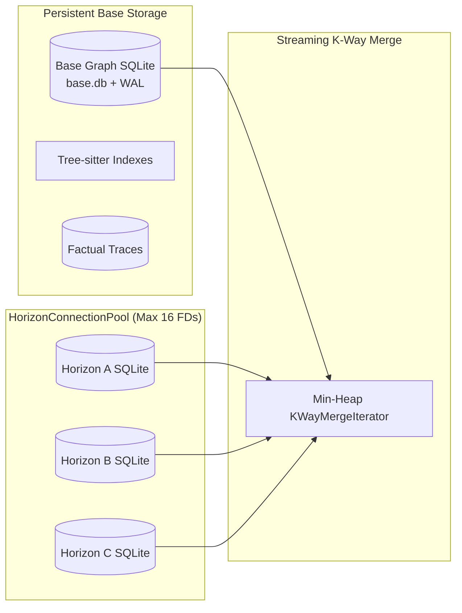

# Infrastructure & Runtime Architecture — Codebase Memory MCP

This document details the low-level infrastructure, compilation pipeline, concurrency models, storage engine, and multi-platform operating system abstractions powering `codebase-memory-mcp`.

---

## 1. Compilation & Toolchain

`codebase-memory-mcp` is implemented in pure **C11** with zero runtime language dependencies (no Python, Node.js, or Java required for the production binary).

### 1.1 Toolchain Matrix

| Component | Specification | Supported Compilers |
| :--- | :--- | :--- |
| **Language Standard** | ISO/IEC 9899:2011 (C11) | GCC 9+, Clang 10+, Apple Clang 12+, MSVC 2022+ |
| **Embedded Database** | SQLite 3.45+ (Amalgamation) | WAL mode, PRAGMA synchronous=NORMAL, mmap enabled |
| **Parsing Engine** | Tree-sitter Runtime (C API) | Vendored grammars for C, C++, Python, TS, JS, Go, Rust |
| **Compression** | Zstandard (`libzstd`) | High-speed graph snapshot compression (`graph.db.zst`) |
| **Build System** | GNU Make (`Makefile.cbm`) | Cross-platform build automation |

### 1.2 Build Targets

```bash
# Compile standard optimized production binary
make -f Makefile.cbm build

# Compile and run foundation C unit tests under ASan/UBSan
make -f Makefile.cbm test-foundation

# Run full C test suite including multi-graph federation
make -f Makefile.cbm test

# Run Union workflow integration suite
make -f Makefile.cbm test-union-workflow

# Build with ThreadSanitizer (TSan) for race detection
make -f Makefile.cbm test-tsan

# Run focused test suite (e.g. union_session, cli)
make -f Makefile.cbm test-focused TEST_SUITES=union_session,cli
```

---

## 2. Storage Engine & Concurrency Model

### 2.1 Base Graph vs Ephemeral Horizons



- **Base Graph Storage**: Located at `.codebase-memory/base.db`. Operates in SQLite Write-Ahead Logging (`WAL`) mode with memory-mapped I/O enabled (`PRAGMA mmap_size = 268435456`).
- **Ephemeral Horizons**: Each speculative horizon allocates a dedicated SQLite database in `.codebase-memory/horizons/<horizon_id>.db`. Horizons never write to `base.db` until explicitly promoted through the Admission Gate.
- **LRU Connection Pool (`HorizonConnectionPool`)**:
  - Operating systems strictly limit open file descriptors per process (default 1024 or 2048; Windows handles).
  - CBM maintains an in-memory LRU pool capped at **16 open SQLite handles**.
  - When a 17th horizon is queried, the least-recently-used SQLite handle is safely flushed and closed without losing disk data.
  - Direct calls to `sqlite3_open_v2` outside the pool are strictly prohibited by architectural invariants.

### 2.2 Streaming K-Way Merge Iterator

When queries specify `active_horizons=[h1, h2]`:
1. The query engine opens ordered cursors over `base.db` and each active horizon database.
2. A **min-heap** orders candidate records by canonical `cbm_uri.hash` (FNV-1a 64-bit).
3. Newer speculative nodes shadow older base nodes in streaming $O(k \log n)$ time with $O(1)$ memory buffer overhead.
4. Traversal cycles are pruned via 64-bit FNV-1a hash sets (`VisitedSet`).

---

## 3. Background Daemon Reaper

Ephemeral horizons left open by crashed agent processes or aborted sessions could accumulate on disk. CBM embeds an autonomous reaper daemon (`src/daemon/horizon_reaper.c`):

- **PID Liveness Verification**:
  - **Windows**: Calls `OpenProcess(PROCESS_QUERY_LIMITED_INFORMATION, FALSE, pid)`.
  - **POSIX**: Calls `kill(pid, 0)`.
  - If the owning agent process has terminated, the horizon is immediately scheduled for reaping.
- **Time-to-Live (TTL) Eviction**:
  - Default TTL: 3600 seconds (1 hour).
  - Any unpromoted horizon idle for longer than TTL is unlinked and its WAL files purged.

---

## 4. Multi-Platform System Abstractions

### 4.1 Windows Native Abstractions
- **Path Separators**: Automatic normalization between forward slashes (`/`) and Windows backslashes (`\`).
- **File Locking**: Native Win32 `LockFileEx` used for project rendezvous locks (`cbm-rendezvous.lock`).
- **Console Encoding**: UTF-8 code page enforcement (`SetConsoleOutputCP(CP_UTF8)`) to guarantee pristine JSON-RPC stdio streaming.

### 4.2 Linux / POSIX Abstractions
- **Inode Operations**: Atomic replacement using `rename(old, new)`.
- **Signal Handling**: Graceful teardown on `SIGTERM` and `SIGINT`, ensuring all WAL checkpoints commit cleanly.

### 4.3 WSL2 & DrvFs Cross-Filesystem Boundary
When running inside WSL2 while accessing Windows filesystem mounts (`/mnt/c/...`):
- **`ETXTBSY` Avoidance**: Updating active binaries uses `install -m 755` rather than `cp`, unlinking the old inode to prevent "Text file busy" errors.
- **DrvFs Timeout Accommodation**: Cross-boundary filesystem I/O can experience 2–5x latency. Test harness sessions extend initialization timeouts to `15.0s`.

---

## 5. Security & Boundary Isolation

- **Non-Privileged Execution**: CBM runs entirely within user-space. No root/admin privileges are ever required.
- **Path Escapes (`Directory Traversal`)**: Every path passed to MCP tools is canonicalized against `cbm_path_within_root`. Any path containing `../` escaping the workspace boundary is rejected with `INVALID_ARGUMENT`.
- **Secret & Token Defense**: Operator tokens (`operator_token`) required for sovereign actions (`founding_decide`, `union_claim_resolve` to `PROMOTED`) are verified using constant-time string comparison (`cbm_secure_memcmp`) to eliminate timing attack vectors.
