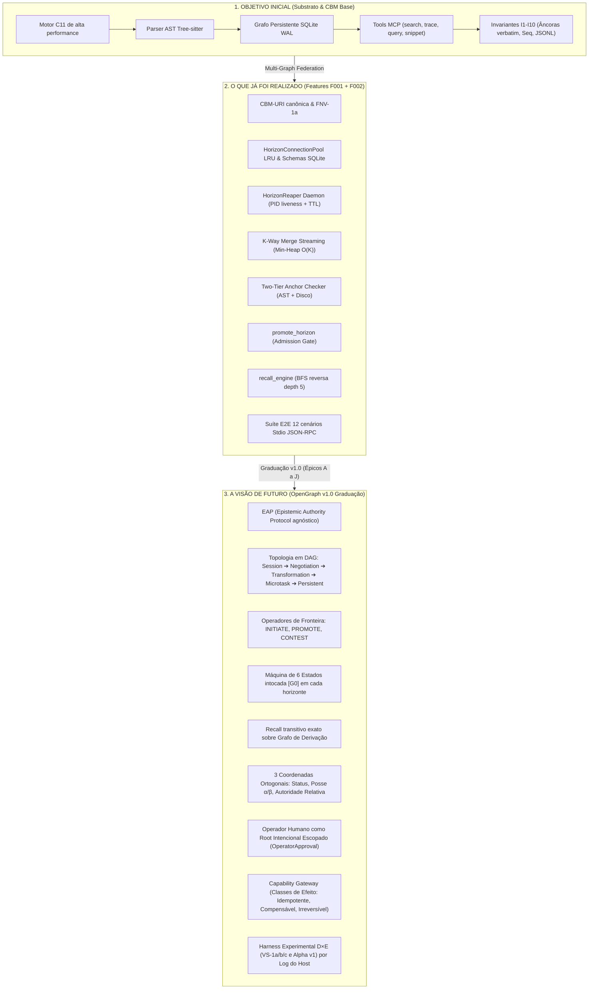

# PBB Refinement & Análise Comparativa — Domínio: `opengraph_v1`

Este documento consolida a leitura integral dos documentos da pasta [`docs/PRD`](file:///c:/Users/corre/Documents/codebase-memory-mcp/docs/PRD) (`PRD.md` e `OpenGraph_Working_Paper_v1_0.md`), confrontando-os com o histórico e documentação técnica indexada no CBM (`docs/adr/`, `docs/product/`, `docs/feature/`, `docs/specs/`, `docs/.digest.md`) e com o grafo persistente do projeto (`27.153 nós`, `135.473 arestas`).

O documento está estruturado em duas partes:
1. **Parte I — Análise Comparativa & Evolutiva:** O Objetivo Inicial, o que já foi Concretizado (Features F001/F002) e a Visão de Futuro (OpenGraph v1.0 / EAP).
2. **Parte II — Product Backlog Building (PBB):** Especificação formal de Problemas, Expectativas, Personas, Funcionalidades, PBIs, Rastreabilidade, Premissas e Questões Abertas.

---

# Parte I — Análise Comparativa & Evolutiva

---

## 1. O Objetivo Inicial (A Gênese do CBM)

O projeto nasceu com uma missão clara: resolver o gargalo de contexto arquitetural e custo exponencial que assistentes de código e LLMs enfrentam ao analisar repositórios extensos.

* **Substrato de Alta Performance:** Um motor compilado em C11 integrado ao SQLite (WAL mode) e runtime de Tree-sitter para extração de símbolos AST, chamadas, referências cruzadas e complexidade ciclomática.
* **Interface MCP (Model Context Protocol):** Exposição padronizada via stdio JSON-RPC de ferramentas para IA (`search_graph`, `trace_path`, `get_code_snippet`, `query_graph`, `get_architecture`).
* **Invariantes Fundamentais Conquistados [B]:**
  * Âncoras literais *verbatim* re-checáveis contra o código-fonte (I1).
  * Posse da verdade com separação entre código-fonte ($\alpha$) e grafo derivado ($\beta$) (I2, I3).
  * Separação estrita de planos: audit log durável em JSONL e cache relacional SQLite descartável/reconstruível (I7).
  * Verificação 100% offline no gate de admissão, sem dependência de rede (I9).

---

## 2. O Que Já Foi Realizado no Projeto (Baseline [B] Conquistada)

Conforme auditado em [`docs/product/DEVELOPMENT-STATE.md`](file:///c:/Users/corre/Documents/codebase-memory-mcp/docs/product/DEVELOPMENT-STATE.md), [`docs/product/DECISIONS.md`](file:///c:/Users/corre/Documents/codebase-memory-mcp/docs/product/DECISIONS.md) e [`docs/feature/multi_graph_federation.md`](file:///c:/Users/corre/Documents/codebase-memory-mcp/docs/feature/multi_graph_federation.md), o ciclo autônomo concluiu as features **F001** e **F002** com score máximo de aprovação técnica e adversarial (0.95 TL / 0.95 Adv):

1. **CBM-URI & Endereçamento Simbólico:** Parser canônico de URIs no formato `cbm://<repo>/<path>#<symbol>` com hashing 64-bit FNV-1a (`src/core/cbm_uri.c`, `cbm_uri.h`).
2. **Isolamento de Horizontes & Conexões LRU:** `HorizonConnectionPool` gerenciando conexões SQLite efêmeras com teto estrito de 16 descritores de arquivo abertos (`src/core/horizon_pool.c`).
3. **Horizon Reaper Daemon:** Worker em background que monitora a liveness de PIDs do sistema operacional e remove bancos de dados órfãos com TTL superior a 1 hora (`src/daemon/horizon_reaper.c`).
4. **K-Way Merge Streaming:** Algoritmo min-heap que combina ordenadamente o Grafo Base persistente com múltiplos horizontes efêmeros sem estourar memória, mantendo complexidade $O(K)$ (`src/query/kway_merge.c`).
5. **Admission Gate & Two-Tier Anchor Checker:** Validação em dois estágios (assinatura AST via Tree-sitter + correspondência exata em disco) antes de promover qualquer nó especulativo à base persistente (`src/admission/anchor_checker.c`).
6. **Mecanismo de Promoção & Recall Inicial:** Tools MCP `promote_horizon` e motor de recall BFS com profundidade máxima de 5 saltos para contestar símbolos após detecção de drift (`src/admission/recall_engine.c`).
7. **Suíte E2E Caixa-Preta (F002):** 12 cenários automatizados cobrindo isolamento multi-agente, concorrência, colisão de refatoração física e tolerância a falhas de processo (`tests/e2e/`).

---

## 3. A Visão de Futuro (OpenGraph v1.0 "Graduação")

Os documentos da pasta [`docs/PRD`](file:///c:/Users/corre/Documents/codebase-memory-mcp/docs/PRD) (`PRD.md` e `OpenGraph_Working_Paper_v1_0.md`) representam a transição de um utilitário MCP para um **Protocolo Aberto de Autoridade Epistêmica (EAP)** para ecossistemas de agentes autônomos.

A tese norteadora do projeto estabelece:
> *"Capacidade de inferir não implica autoridade para afirmar. Capacidade de produzir não implica autoridade para persistir."*

### As Grandes Rupturas da v1.0
1. **Extração do EAP (Epistemic Authority Protocol):** A semântica de admissão, promoção, contestação e revogação é extraída como protocolo formal agnóstico de transporte. O MCP passa a ser apenas o primeiro *binding* de transporte.
2. **Topologia de Horizontes como DAG Normativo:** Formalização da hierarquia `Sessão` $\to$ `Negociação` $\to$ `Transformação` $\to$ `Microtarefa` $\to$ `Persistente`. Saltos de nível de promoção são bloqueados mecanicamente (`HORIZON_SKIP`).
3. **Operadores de Fronteira Tipados:**
   * `INITIATE`: Carrega contexto inicial (`NegotiationSeed`), mas **zero autoridade**.
   * `PROMOTE`: Envia `PromotionProposal` tipada, avaliada de forma **completamente cega ao chamador** (*Caller-Blindness*).
   * `CONTEST`: Permite desafiar qualquer afirmação com evidência re-verificável, propagando degradação.
4. **Verdade Versionada & Recall Epistêmico Exato:** Corrigir a verdade admitida não é editar nem sobrescrever histórico; é emitir um `RecallNotice` que dispara o fechamento transitivo inverso ($deps^{-1}$) sobre o grafo de derivação admitido.
5. **Três Coordenadas Ortogonais de Verdade:** Sem colapso em score numérico ou probabilístico:
   * **Status:** `proposed`, `admitted`, `contested`, `superseded`, `revoked`.
   * **Posse:** `source` ($\alpha$), `graph` ($\beta$), `suspended` (exclusivo de células do persistente).
   * **Autoridade Relativa:** Incompleta ou completa no escopo do horizonte.
6. **Operador Humano como Root Intencional Escopado:** O humano governa intenção, preferência de negócio e assume riscos irreversíveis via `OperatorApproval` com escopo, validade temporal e de $seq$. O humano **não pode fabricar evidências** diante do gate técnico (simetria estrita na verificação).
7. **Capability Gateway & Classes de Efeito:** Nenhuma ferramenta executa sem classificação prévia: *Idempotente*, *Compensável* ou *Irreversível*. Para ações irreversíveis, o registro no log de auditoria **precede** a execução física.
8. **Método Científico de Graduação:** Validação por logs do host (nunca por autorrelato de LLMs), suíte adversarial T1–T14 e experimento D×E (comparando substrato puro contra a pilha cognitiva completa).

---

## 4. Matriz Comparativa: `docs/PRD` vs. Restante de `docs/`

| Dimensão | Estado Atual no Repositório (`docs/`) | Visão no PRD (`docs/PRD/`) | Gap Identificado |
|---|---|---|---|
| **Papel do Sistema** | Servidor de indexação e overlay efêmero para MCP. | Especificação do protocolo EAP e implementação de referência de arquitetura cognitiva. | Formalização e separação entre especificação de protocolo e engine. |
| **Topologia** | Horizontes isolados criados sob demanda com `parent` implícito. | DAG normativo de 5 horizontes com contratos tipados de iniciação e transição. | Ausência de validação estrutural contra `HORIZON_SKIP` e formalização do DAG. |
| **Ciclo de Vida** | Nós adicionados a horizontes e promovidos diretamente via `promote_horizon`. | Máquina Epistêmica de 6 Estados (`PROPOSE` $\to$ `DELIBERATE` $\to$ `ADMIT` $\to$ `CONCRETIZE` $\to$ `VERIFY` $\to$ `AUTHORITY`) em cada horizonte. | Falta instrumentar formalmente os 6 estados e separar autômato de workflow (Router) do autômato de autoridade. |
| **Mecanismo de Recall** | BFS reversa em C limitada a profundidade 5 sobre arestas de referência. | Fechamento transitivo exato ($deps^{-1}$) no grafo de derivação com 3 coordenadas ortogonais. | O motor atual busca referências simbólicas, mas não possui grafo de derivação de claims com histórico versionado imutável. |
| **Operador Humano** | Cliente MCP que invoca tools sem restrição formal de escopo. | Root intencional com `OperatorApproval` tipada, escopada, com TTL e $seq$ de validade. | Ausência de contrato de aprovação, permitindo aprovações tácitas ou fora de escopo. |
| **Execução de Tools** | Handlers MCP executam comandos diretamente. | Capability Gateway com classificação de efeito (idempotente/compensável/irreversível) e registro prévio. | Falta interceptor de governança de ferramentas e ledger de orçamento por horizonte. |

---

# Parte II — Product Backlog Building (PBB)

## 1. Product

**OpenGraph — Epistemic Authority Protocol (EAP) & Reference Engine**  
Plataforma e protocolo aberto para agentes autônomos que desacopla capacidade de execução de autoridade epistêmica, garantindo verdade versionada, contenção de alucinações, promoção governada por evidências e correção retroativa por recall calculável.

---

## 2. Problems

* **PRB-01 (Autoridade Falsa por Capacidade):** Agentes de IA persistem suposições e deduções não verificadas no conhecimento persistente como se fossem fatos comprovados.
* **PRB-02 (Contaminação Irreversível):** Quando uma informação admitida na base persistente se revela falsa, o sistema não sabe quais decisões ou afirmações derivadas foram contaminadas, exigindo edição manual ou aceitando propagação de erros.
* **PRB-03 (Alucinação em Cadeia Multi-Agente):** Na colaboração entre múltiplos agentes, sub-tarefas saltam etapas de validação e promovem artefatos diretamente ao repositório central sem consenso nem checagem intermediária.
* **PRB-04 (Operador Humano como Chave Mestra Falha):** A aprovação humana é tratada como oráculo infalível, permitindo que assinaturas aprovem código sem âncora real no repositório ou fora do escopo pretendido.
* **PRB-05 (Efeitos Colaterais Incontrolados de Ferramentas):** Ferramentas externas e comandos de terminal são disparados por agentes sem classificação de risco ou registro durável prévio à mutação do ambiente.
* **PRB-06 (Conformidade Opaca do Ecossistema):** Clientes e frameworks de agentes afirmam compatibilidade com memória estruturada sem demonstrar adesão mecânica a contratos de autoridade.

---

## 3. Expectations

* **EXP-01:** Nenhuma afirmação ou código deve ingressar no grafo persistente sem âncora verificável e prova de cobertura fechada, independentemente de quem a gerou.
* **EXP-02:** A descoberta de um erro na base deve suspender automaticamente e de forma determinística todas as dependências transitivas afetadas, mantendo o histórico intacto.
* **EXP-03:** A comunicação entre agentes deve seguir um DAG de horizontes rígido, onde a promoção exige atravessar fronteiras com propostas tipadas e avaliação cega ao chamador.
* **EXP-04:** O operador humano deve governar intenção, objetivos e riscos irreversíveis, mas deve ser impedido de fabricar evidências ou bypassar o gate técnico.
* **EXP-05:** Todas as ferramentas devem ser classificadas por impacto, exigindo autorização contratual e registro prévio de intenção para qualquer ação irreversível.
* **EXP-06:** O ecossistema deve poder certificar agentes e servidores em níveis claros de conformidade (L0 a L4) verificáveis por log de host, sem adaptações proprietárias.

---

## 4. Personas

### PER-01: Operador Humano (Root Intencional)
* **Objetivo:** Definir os objetivos de negócio, arbitrar conflitos de valor, escolher entre caminhos alternativos válidos e autorizar riscos calculados e operações irreversíveis.
* **Interações:** Define seeds de negociação, aprova contratos de mudança escopados (`OperatorApproval`), revisa escalonamentos em `WAITING_HUMAN`.
* **Problemas & Expectativas:** Sofre com fadiga de aprovação e risco de assinar algo que quebra o sistema; espera que sua aprovação seja estritamente delimitada e que o sistema o impeça de burlar validações técnicas.

### PER-02: Integrador de Flavor / Desenvolvedor de Agentes
* **Objetivo:** Conectar um agente autônomo (Claude, Gemini, Cursor, Aider, etc.) ao OpenGraph sem necessidade de reescrever a arquitetura interna do agente.
* **Interações:** Consome ferramentas MCP/EAP em conformidade L0 ou L1, declara o nível do agente e a taxonomia de efeitos das ferramentas do seu adapter.
* **Problemas & Expectativas:** Falta de clareza sobre como lidar com recusas estruturadas; espera um checklist executável e mensagens de recusa fechadas com obrigação de cliente explícita.

### PER-03: Auditor de Governança e Segurança
* **Objetivo:** Inspecionar a linha do tempo de decisões, proveniência de alterações no código e alcance de eventuais contaminações ou recalls.
* **Interações:** Consulta o log append-only durável (JSONL), inspeciona fechamentos transitivos de recall, rastreia quem aprovou cada risco sob qual snapshot de $seq$.
* **Problemas & Expectativas:** Perda de rastreabilidade e estados sobrescritos; espera histórico imutável e capacidade de reproduzir exatamente o que o sistema acreditava em qualquer momento do tempo.

---

## 5. Functionalities

* **FNC-01 (Gestão de DAG Topológico de Horizontes):** Orquestrar a hierarquia formal de horizontes cognitivos (Sessão, Negociação, Transformação, Microtarefa, Persistente) e barrar saltos estruturais.
* **FNC-02 (Promoção Cega de Propostas de Mudança):** Submeter, auditar e admitir propostas tipadas (`PromotionProposal` e `PersistentDelta`) através de avaliação cega ao proponente.
* **FNC-03 (Recall Epistêmico e Cascata Determinística):** Processar avisos de contestação e invalidar em cascata o fechamento transitivo inverso sobre o grafo de derivação.
* **FNC-04 (Aprovação Escopada do Operador):** Emitir, validar validade temporal/sequencial e limitar o raio de ação das aprovações humanas.
* **FNC-05 (Gateway de Efeitos e Orçamento de Ferramentas):** Interceptar execuções de ferramentas, impor registro prévio para irreversíveis e debitar orçamentos dos horizontes.
* **FNC-06 (Certificação de Conformidade EAP):** Executar bateria de validação de protocolos para clientes L0–L1 e hosts L2–L4 via auditoria de logs.

---

## 6. Product Backlog

### Backlog da Funcionalidade FNC-01: Gestão de DAG Topológico de Horizontes

#### PBI-01: Validação Estrutural de Adjacência do DAG
* **Como** Host do Grafo,
* **Quero** rejeitar com erro `HORIZON_SKIP` qualquer proposta de promoção cujo horizonte alvo não seja o pai imediato na topologia declarada,
* **Para que** microtarefas não promovam mudanças diretamente para a base persistente sem passar pela transformação e negociação.

#### PBI-02: Iniciação de Horizonte com Seed de Contexto Tipado
* **Como** Agente Orquestrador,
* **Quero** instanciar novos horizontes a partir de contratos estruturados (`NegotiationSeed`, `ChangeContract`, `WorkOrder`) contendo referências de sessão e $seq$ de base,
* **Para que** o novo contexto herde as intenções necessárias como estado proposto sem herdar autoridade pré-admitida.

---

### Backlog da Funcionalidade FNC-02: Promoção Cega de Propostas de Mudança

#### PBI-03: Esquema Tipado de `PromotionProposal` e Validação Estrutural
* **Como** Host de Fronteira,
* **Quero** exigir que propostas de promoção contenham resumo de exclusão (`excluded_summary`), evidências, premissas (`assumptions[]`), $seq$ de base e proveniência,
* **Para que** nenhuma submissão incompleta ou sem prestação de contas dos caminhos descartados seja avaliada.

#### PBI-04: Avaliação de Admissão Cega ao Chamador (*Caller-Blindness*)
* **Como** Admission Gate,
* **Quero** avaliar o mérito técnico do conjunto de claims e deltas de forma agnóstica à identidade do agente remetente,
* **Para que** identidades distintas ou conluios entre agentes não influenciem o veredito de aceitação.

#### PBI-05: Detecção e Bloqueio de Omissão de Premissas (*Drop Detection*)
* **Como** Auditor de Admissão,
* **Quero** comparar as premissas ativas no horizonte filho com as premissas declaradas na proposta e recusar com `ASSUMPTION_DROPPED` caso alguma tenha sido omitida,
* **Para que** suposições não sejam silenciadas durante a subida de nível.

---

### Backlog da Funcionalidade FNC-03: Recall Epistêmico e Cascata Determinística

#### PBI-06: Processamento de `RecallNotice` com Fechamento Transitivo Inverso
* **Como** Motor de Governança,
* **Quero** calcular o fechamento $deps^{-1}$ deterministicamente sobre o grafo de derivação admitido quando uma claim for revogada,
* **Para que** todos os artefatos e claims que dependeram do nó defeituoso sejam suspensos atomicamente.

#### PBI-07: Degradação Ortogonal de Status e Posse
* **Como** Engine do Grafo,
* **Quero** transitar claims derivadas para status `contested` e células físicas de posse $\beta$ para `suspended` (marcando cicatriz),
* **Para que** a degradação de posse física não seja confundida com status de verdade lógica.

#### PBI-08: Reabilitação Célula a Célula por Prova Nova
* **Como** Agente Mantenedor,
* **Quero** reabilitar células em estado `suspended` exclusivamente através de novo ciclo completo de verificação com âncora comprovada,
* **Para que** nenhuma suspensão seja anulada em bloco ou por decreto sem evidência.

---

### Backlog da Funcionalidade FNC-04: Aprovação Escopada do Operador

#### PBI-09: Contrato Tipado de `OperatorApproval` com Invalidação por $seq$ e TTL
* **Como** Router de Governança,
* **Quero** invalidar autorizações humanas se o $seq$ do banco avançar ou o TTL expirar antes do consumo da ação,
* **Para que** consentimentos antigos não sejam aplicados sobre um estado de mundo que já se alterou.

#### PBI-10: Bloqueio de Fabricação de Evidências por Assinatura Humana
* **Como** Admission Gate,
* **Quero** emitir recusa terminal `EVIDENCE_REQUIRED` caso uma aprovação do operador tente forçar a admissão de nós sem âncora de código correspondente,
* **Para que** o operador humano permaneça soberano sobre intenção e risco, mas incapaz de violar os fatos físicos do código.

---

### Backlog da Funcionalidade FNC-05: Gateway de Efeitos e Orçamento de Ferramentas

#### PBI-11: Classificação Tripla de Ferramentas e Política Padrão Irreversível
* **Como** Capability Gateway,
* **Quero** classificar todas as ferramentas registradas como idempotentes, compensáveis ou irreversíveis (tratando não classificadas como irreversíveis),
* **Para que** ferramentas perigosas não executem sem autorização explícita e governada.

#### PBI-12: Registro Prévio de Intenção para Ações Irreversíveis
* **Como** Auditor de Execução,
* **Quero** gravar a intenção e os parâmetros de uma ação irreversível no log durável antes de permitir o despacho físico do comando,
* **Para que** mesmo em caso de falha de processo ou queda de máquina, a ação reste completamente rastreável.

#### PBI-13: Débito em Ledger de Orçamento por Horizonte
* **Como** Host de Horizonte,
* **Quero** registrar tokens, tempo, ciclos e chamadas de ferramentas em um ledger de débito e abortar com `BUDGET_EXHAUSTED` caso o teto seja atingido,
* **Para que** loops infinitos de agentes nunca resultem em aprovação tácita por exaustão.

---

### Backlog da Funcionalidade FNC-06: Certificação de Conformidade EAP

#### PBI-14: Taxonomia Fechada de Recusas com Obrigação de Cliente
* **Como** Integrador de Flavor,
* **Quero** receber códigos padronizados de recusa acompanhados da ação corretiva esperada pelo protocolo,
* **Para que** o agente cliente possa corrigir sua solicitação de forma determinística sem análise heurística de mensagens livres.

#### PBI-15: Harness de Conformidade Baseado em Logs de Host
* **Como** Certificador de Protocolo,
* **Quero** avaliar se um flavor atinge conformidade L0–L1 através da inspeção dos eventos registrados pelo servidor host,
* **Para que** nenhum agente seja certificado com base em autorrelato ou métricas não verificáveis.

---

## 7. Traceability

| Problema | Expectativa | Persona | Funcionalidade | PBIs Derivados |
|---|---|---|---|---|
| **PRB-01** (Autoridade Falsa) | **EXP-01** (Validação Rígida) | PER-02 | FNC-02 | PBI-03, PBI-04 |
| **PRB-02** (Contaminação Irreversível) | **EXP-02** (Recall Determinístico) | PER-03 | FNC-03 | PBI-06, PBI-07, PBI-08 |
| **PRB-03** (Alucinação Multi-Agente) | **EXP-03** (DAG e Promoção Cega) | PER-02 | FNC-01, FNC-02 | PBI-01, PBI-02, PBI-05 |
| **PRB-04** (Operador Chave Mestra) | **EXP-04** (Operador Escopado) | PER-01 | FNC-04 | PBI-09, PBI-10 |
| **PRB-05** (Efeitos de Ferramentas) | **EXP-05** (Gateway e Auditoria) | PER-01, PER-03 | FNC-05 | PBI-11, PBI-12, PBI-13 |
| **PRB-06** (Conformidade Opaca) | **EXP-06** (Certificação L0-L4) | PER-02, PER-03 | FNC-06 | PBI-14, PBI-15 |

---

## 8. Assumptions

1. **ASM-01:** O motor C11 existente no repositório (`src/core`, `src/store`, `src/admission`) atuará como a camada fundacional do Substrato e do Host L3 da implementação de referência.
2. **ASM-02:** O transporte MCP existente no repositório continuará operando como o primeiro binding de transporte de EAP sem descontinuar clientes legados.
3. **ASM-03:** A separação de planos (Substrato, Runtime, Cognitivo) e a Máquina Epistêmica de 6 Estados permanecerão imutáveis conforme o critério [G0].
4. **ASM-04:** Os testes de conformidade e verificação serão sempre executados contra logs duráveis do host, desconsiderando completamente explicações ou feedbacks gerados via prompt pelas LLMs.

---

## 9. Open Questions

### Q01 — Qual subsistema e feature real do repositório será o objeto empírico do teste Alpha v1?

**Suggested answer:** Selecionar uma alteração transversal no próprio pipeline de parsing/indexação de CBM (por exemplo, suporte a um novo constructo semântico de linguagem), onde não haja suíte de teste prévia cobrindo a feature e a inferência de impacto não seja trivial.

**Rationale:** O teste do Alpha v1 exige uma feature transversal sem teste que a especifique, com claims commitadas e medição por log do uso real do servidor entre os braços D (substrato sem Cognitive Plane) e E (VS-1c completa).

**Resolved answer:** Unresolved

**Answered by:** unresolved

**Status:** Provisional model assumption

---

### Q02 — Como será balanceada a fricção do operador humano (TTL de aprovação) para evitar abandono sem gerar aprovação automática por fadiga?

**Suggested answer:** Adotar inicialmente os valores conservadores descritos no paper (risco 24h, defasagem de $seq$ 1h, ações irreversíveis de uso único), medindo o `Approval Staleness Rate` e a taxa de contorno na suíte VS-1c antes de flexibilizar.

**Rationale:** Facilitar aprovações sem métrica comprovada recai no risco RK-6 (fadiga como vetor de ataque). A fricção inicial deve ser tratada como dado de calibração empírica da hipótese H11.

**Resolved answer:** Unresolved

**Answered by:** unresolved

**Status:** Provisional model assumption

---

### Q03 — Quais os três primeiros flavors de agentes que serão submetidos ao checklist de conformidade L0–L1 para fechamento do critério de graduação [G2]?

**Suggested answer:** Selecionar três flavors com arquiteturas e mecanismos de tool-calling comprovadamente distintos dentre os 11 presentes no registry do repositório (por exemplo: Claude Desktop/CLI, Aider e Cursor).

**Rationale:** A hipótese H12 exige demonstrar interoperabilidade de protocolo sem adaptações server-side específicas por flavor. Escolher antecipadamente os três flavors impede viés de seleção post-hoc.

**Resolved answer:** Unresolved

**Answered by:** unresolved

**Status:** Provisional model assumption
