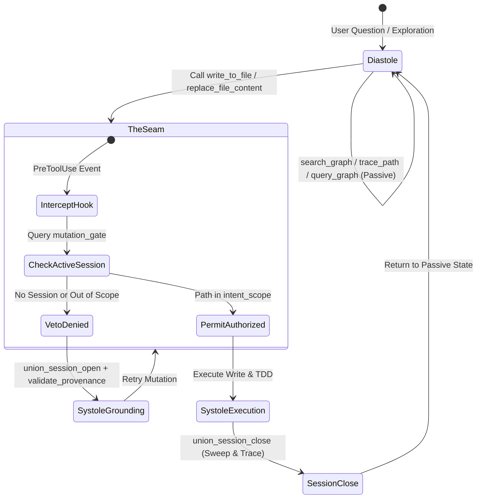

# ADR-001 — Cognitive Respiration and The Mutation Seam

## OVERVIEW
Establishes the Cognitive Respiration architecture (SCOPE-E01) as the governing lifecycle model between exploratory agent queries (Diástole) and physically mutating code changes (Sístole), mediated by host lifecycle hooks at the mutation boundary ("The Seam").

## CONTEXT & PROBLEM STATEMENT
Prior implementations treated activity classification (`CONSULTATIVE` vs `SPECIALTY`) as a static, premature prompt-time division. This caused severe pathologies:
1. **Horizon Pollution**: The system opened session horizons (`union_session_open`) and generated session nodes during trivial code searches and read-only questions.
2. **Lock Contention**: Concurrency file locks (`cbm-startup-v2.lock`, `cbm-rendezvous.lock`) were acquired during passive exploration, inducing deadlocks and latency.
3. **Epistemic Violence**: Forcing grounding rituals before the agent even determined whether code changes were necessary frustrated human developers.

## DECISION
1. **The Principle of Cognitive Respiration**: Cognition operates as a continuous respiratory cycle:
   - **Diástole (Expansion / Contemplation)**: Reading code, symbol search, call tracing, and schema inspection are completely passive. The CBM graph behaves as an immutable oracle with **zero sessions, zero locks, and zero ledger debits**.
   - **The Seam (O Limiar)**: The physical threshold where imagination touches the filesystem. Triggered exclusively when file mutation tools (`write_to_file`, `replace_file_content`) are invoked.
   - **Sístole (Compression / Governance)**: A PreToolUse host hook intercepts the mutation, requiring an active session horizon with an explicit `intent_scope` whitelist (1 to 4 path/op pairs).
2. **The 7-Level Spectrum of Psychic Density**:
   - Level 0: Pure Contemplation (Passive reads)
   - Level 1: Ideation & Architectural Projection
   - Level 2: The Seam (Mutation Attempt)
   - Level 3: Just-In-Time Grounding & Session Open (`union_session_open`)
   - Level 4: Material Sacrifice / TDD Nigredo (Failing test)
   - Level 5: Sublimation & Implementation (Passing code & refactor)
   - Level 6: Integration & Anamnesis (Sweep & Session Close)
3. **Whitelist Intent Scope**: A session horizon explicitly scopes which files may be touched. Attempts to write to unlisted files are vetoed at the hook level.

## CONSEQUENCES

### Positive
- Zero overhead and blazing speed during code exploration and architectural discovery.
- Absolute prevention of runaway edits: unlisted files cannot be modified by autonomous agents.
- Clear separation between semantic gateway refusals and OS host hook vetoes in telemetry.

### Negative / Trade-offs
- Agents must learn to catch hook vetoes and open bounded sessions just-in-time.
- Multi-file refactorings require careful declaration of up to 4 file paths per session.

## REFERENCES
- [**ARCHITECTURE.md**](./ARCHITECTURE.md): System architecture.
- [**TESTS.md**](./TESTS.md): Testing protocol.
- [**mutation_gate.md**](../feature/mutation_gate.md): Feature specification for the mutation seam and hook integration.
