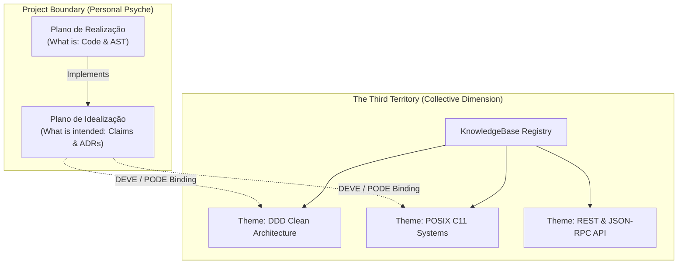

# ADR-002 — The Three Epistemic Territories & The Law of Provenance

## OVERVIEW
Formulates the epistemic division of engineering knowledge into Three Territories (Realization Plane, Idealization Plane, and Thematic Tradition) and establishes the Law of Craft Provenance to eliminate silent invention and archetypal possession.

## CONTEXT & PROBLEM STATEMENT
Large language models possess immense pre-trained knowledge, but this training represents a hidden, unaccountable thematic graph: it always exists, is never cited, and cannot be contested. When an agent creates code or architecture relying silently on statistical taste, it exhibits **Archetypal Possession** — speaking with false authority while masking the true provenance of its choices.

A single project's repository cannot resolve this:
- Code files answer *What is* (Realization).
- ADRs and issues answer *What is intended* (Idealization).
- Neither plane answers *How the institution exercises craft* (Tradition).

## DECISION

### 1. The Three Epistemic Territories

| Territory | Question Answered | Scope | Storage Location | Write Access |
| :--- | :--- | :--- | :--- | :--- |
| **1. Plano de Realização** | *What is?* | Single project | AST, SQLite base graph, source files | Governed via TDD & Admission Gate |
| **2. Plano de Idealização** | *What is intended & why?* | Single project | Claim nodes, ADRs, open decisions | Admitted via human operator credentials |
| **3. Terceiro Território (A Tradição)** | *How craft is done?* | **Cross-project / Collective** | External `KnowledgeBase` theme catalogs | **Read-Only to project**. Referenced, never written |

### 2. The Law of Provenance of Craft
Every specialty judgment or architectural convention applied by an agent must satisfy the **Epistemic Provenance Dichotomy**:
1. **Cânone Citado (Cited Canon)**: The decision resolves into an exact node of a bound theme (`theme_lookup` + `binding_claim`).
2. **Invenção Declarada (Declared Invention)**: The agent explicitly confesses that no theme governs the decision, documenting its working hypothesis and rationale.
3. If an agent emits a specialty judgment without citing canon and without declaring invention, the system issues a typed refusal:
   $$\text{Verdict} \longrightarrow \texttt{PROVENANCE\_UNDECLARED}$$

### 3. Binding Semantics: DEVE vs PODE
- **Bound (DEVE - Normative)**: The project formally binds a theme version via `binding_claim`. Deviations are permitted only as explicit, expensive scars recorded on the Idealization Plane.
- **Consulted (PODE - Advisory)**: The project references a theme for guidance without normative enforcement.

## CONSEQUENCES

### Positive
- Eradicates silent invention: human engineers always know whether code reflects institutional norms or agent improvisation.
- Tacit team taste converts from unwritten "vibes" into governed, versioned, reusable memory.
- Enables the **Uroboros Cycle**: inventions that prove generally useful can be harvested via `founding_propose` to seed new themes.

### Negative / Trade-offs
- Agents must execute `validate_provenance` before generating specialty code.
- Teams must register and curate themes to minimize declared inventions.

## REFERENCES
- [**ARCHITECTURE.md**](./ARCHITECTURE.md): System architecture.
- [**PRD_V3.md**](../PRD/novos-paradgimas/PRD_V3.md): The Third Territory specification.
- [**PRD_PTBR.md**](../PRD/novos-paradgimas/PRD_PTBR.md): Psychological foundations.
