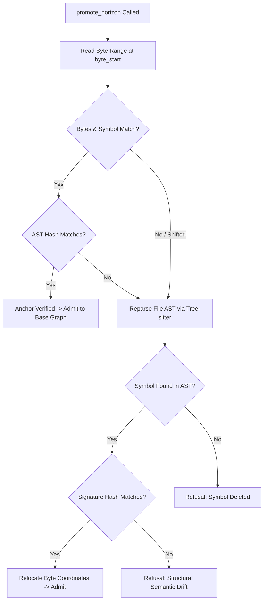

# ADR-003 — Two-Tier AST Anchors & Horizon Admission Gate

## OVERVIEW
Specifies the Two-Tier AST Anchor architecture and the Admission Gate protocol (`promote_horizon`) for safely admitting speculative cognitive horizons into the persistent Base Graph without corrupting symbol coordinates.

## CONTEXT & PROBLEM STATEMENT
Speculative changes in ephemeral cognitive horizons refer to code symbols located in source files. In multi-agent environments or active repositories:
1. **Line Number Fragility**: Simple line numbers (e.g. `file.c:45`) invalidate immediately whenever a comment or line is inserted above.
2. **Concurrent Edits**: If an external developer or parallel agent modifies a file while an agent deliberates in a horizon, committing blind offsets corrupts graph coordinates.
3. **Semantic Invariance**: Adding whitespace, blank lines, or reformatting should not invalidate a valid architectural refactoring if the abstract syntax tree remains identical.

## DECISION

### 1. Two-Tier Anchor Anatomy
Every anchor submitted during horizon promotion combines two complementary tiers:

```text
┌─────────────────────────────────────────────────────────────┐
│  Tier 1: Byte-Range Coordinates (Fast-Path Check)           │
│  - file_path: "src/billing/payment.c"                       │
│  - symbol_name: "validate_transaction"                      │
│  - byte_start: 2048, byte_len: 180                          │
│  => Verified in O(1) by inspecting raw file bytes.          │
├─────────────────────────────────────────────────────────────┤
│  Tier 2: Tree-sitter AST Signature Hash (Resilience Check)  │
│  - ast_signature_hash: 0x9f8b2a1c0d4e5f67                   │
│  => Computed by hashing the normalized Tree-sitter syntax    │
│     tree of the declaration, excluding trivia & comments.   │
└─────────────────────────────────────────────────────────────┘
```

### 2. Admission Gate Algorithm (`cbm_admission_gate_admit`)
During `promote_horizon`:
1. **Tier 1 Fast Evaluation**: The gate reads the bytes at `[byte_start, byte_start + byte_len]`. If the text matches and AST hash matches, the anchor is verified in $O(1)$ time.
2. **Tier 2 Recovery & Relocation**: If byte offsets do not match (e.g., lines shifted due to an earlier edit), the gate triggers Tree-sitter AST reparsing for `file_path`:
   - It searches for `symbol_name`.
   - If found, it computes the new AST signature hash.
   - If the hash matches `ast_signature_hash`, the gate **automatically relocates the anchor coordinates** to the new byte range and records a benign shift.
3. **Drift Rejection**: If the symbol is missing, or if the AST signature hash changed (meaning the code itself was modified concurrently), the gate **refuses admission**:
   $$\text{Verdict} \longrightarrow \texttt{ADMISSION\_REFUSED\_ANCHOR\_DRIFT}$$



## CONSEQUENCES

### Positive
- Immune to simple line-shift invalidation caused by upstream file edits or formatting.
- Eliminates silent graph corruption: changes are admitted only when semantic integrity is strictly proven.
- Extremely fast for 99% of promotions where files have not been concurrently edited.

### Negative / Trade-offs
- Requires Tree-sitter parsing in C during Tier 2 fallback.
- Code generation tools must capture initial byte offsets and compute AST hashes when creating anchors.

## REFERENCES
- [**ARCHITECTURE.md**](./ARCHITECTURE.md): System layers and admission gate.
- [**TESTS.md**](./TESTS.md): Anchor checker unit tests (`tests/test_anchor_checker.c`).
- [**multi_graph_federation.md**](../feature/multi_graph_federation.md): Ephemeral horizons feature.
