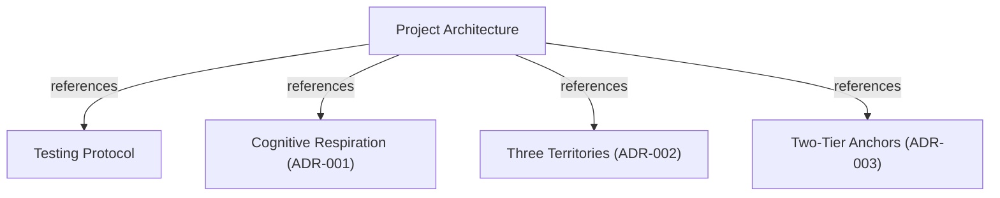

# Project Architecture

## OVERVIEW
Layered C11 architecture providing persistent codebase knowledge indexing, multi-graph cognitive horizon federation, epistemic authority workflows, and Model Context Protocol (MCP) JSON-RPC tool endpoints over SQLite storage.

## FOLDER STRUCTURE
<folder_structure>
```
[project_root]/
├── src/                          # Core C11 codebase implementing indexing, federation, and union
│   ├── core/                     # Canonical CBM-URI, LRU connection pools, and symbolic nodes
│   ├── query/                    # Cypher execution, k-way merge iterators, and min-heap
│   ├── admission/                # Two-tier AST anchor verification, admission gate, and recall
│   ├── union/                    # Session horizons, skill contracts, effect gateways, and craft themes
│   ├── daemon/                   # Background reaper daemon and project lock coordination
│   ├── db/                       # SQLite schema definitions and migrations
│   ├── mcp/                      # JSON-RPC protocol server, federated handlers, and union endpoints
│   ├── pipeline/                 # Tree-sitter parsing and index generation pipeline
│   └── store/                    # Base graph SQLite persistent storage
├── tests/                        # C unit/integration suites, E2E runner, and regression suites
└── docs/                         # Technical documentation, ADRs, and feature specifications
    ├── adr/                      # Architectural Decision Records and baseline protocols
    ├── feature/                  # Feature domain documentation and source routing
    ├── guide/                    # Consumption, tools reference (35 tools), and workflows
    ├── PRD/                      # Product requirements, vision (PTBR/V1/V2/V3), and specs
    ├── audit/                    # Technical audit reports and investment rationales
    └── archive/                  # Historical specifications and product logs
```
</folder_structure>

## LAYERS
- **Transport / Protocol**: MCP JSON-RPC stdio server dispatching 35 tool endpoints across discovery (10), inspection (7), horizons (4), and union workflows (14).
- **Epistemic Authority & Gateways**: `CbmGateway` effect classification, `CbmContractRegistry`, and `CbmSessionRegistry`.
- **Thematic Knowledge & Doc Plane**: `CbmThemeRegistry`, `CbmBindingLedger`, and `CbmContestRegistry`.
- **Federation & Admission**: `AdmissionGate` with cross-horizon concurrency arbitration and `BEGIN IMMEDIATE` atomic serialization, `TwoTierAnchor` verification against AST, and `EpistemicRecallService`.
- **Query & Merging**: Streaming `KWayMergeIterator` over ordered cursors combining Base Graph and active horizons.
- **Core & Domain**: `CbmUri` addressing, `SymbolicNode` management, and LRU bounded `HorizonConnectionPool` with process liveness probing.
- **Persistence & Daemons**: Base SQLite graph, per-horizon SQLite WAL databases, and `HorizonReaperService`.

## MODULES
| Module | Responsibility | Location |
|---|---|---|
| Core Addressing & Pools | Canonical CBM-URI parsing, FNV-1a hashing, and LRU SQLite connection management | `src/core/` |
| Query & Federation | Streaming K-Way merge iterator with min-heap and Cypher federation | `src/query/` |
| Admission & Recall | Two-tier AST anchor checking, cross-horizon concurrency arbitration, promotion gates, and acyclic reverse recall | `src/admission/` |
| Union Workflows & Sessions | Session horizons, skill contracts, effect gateways, and refusal taxonomy | `src/union/` |
| Thematic Knowledge Bases | Craft theme registries, normative/consulted binding claims, and founding proposals | `src/union/` |
| Document Plane Substrate | Structural section extraction (L0), referential resolution (L1), and prose drift | `src/union/` |
| MCP Server & Tools | JSON-RPC dispatch, federated tool handlers, and union tool endpoints | `src/mcp/` |
| Daemon & Reaping | Stale horizon cleanup, OS PID verification, and daemon coordination | `src/daemon/` |
| Storage & Schema | SQLite table schemas, migration scripts, and persistent node/edge storage | `src/store/`, `src/db/` |

## PATTERNS
<code_patterns>
# REQUIRED: Pool-managed SQLite handle acquisition with LRU eviction
sqlite3 *db = NULL;
int rc = cbm_horizon_pool_get(&pool, horizon_id, &db);
if (rc == CBM_URI_OK) {
    /* Execute queries against horizon SQLite database */
}

# FORBIDDEN: Direct unmanaged SQLite handle creation outside pool
sqlite3 *db = NULL;
sqlite3_open_v2("unmanaged.db", &db, SQLITE_OPEN_READWRITE, NULL);

# REQUIRED: Gateway effect verification before executing state mutations
if (!cbm_gateway_allows(&session->contract, effect)) {
    return cbm_refusal_create(REFUSAL_OUT_OF_SCOPE, "Effect exceeds contract");
}

# FORBIDDEN: Unchecked mutation execution bypassing effect gateway
apply_systemic_change(session, payload); // Bypasses contract boundaries

# REQUIRED: Cycle-pruned traversal with 64-bit FNV-1a VisitedSet
VisitedSet visited = cbm_visited_init();
cbm_visited_add(&visited, uri.hash);

# FORBIDDEN: Unbounded recursive graph traversal without visited guards
traverse_dependencies(node); // Vulnerable to stack overflow on cyclic references

# REQUIRED: Caller-blind contestation check before horizon promotion
if (cbm_contest_has_blocking(&srv->contest_registry, target_ref)) {
    return cbm_mcp_text_result("Promotion blocked: unresolved contestation exists", true);
}

# FORBIDDEN: Promoting horizons with active blocking contestations
cbm_admission_gate_admit(gate, horizon_id, anchors, count); // Ignores contested evidence

# REQUIRED: Optimistic generation check within BEGIN IMMEDIATE lock to prevent TOCTOU drift
sqlite3_exec(gate->base_db, "BEGIN IMMEDIATE;", NULL, NULL, NULL);
if (current_gen > gate->base_generation) {
    sqlite3_exec(gate->base_db, "ROLLBACK;", NULL, NULL, NULL);
    return CBM_ADMISSION_ERR_CONCURRENT_CONFLICT;
}

# FORBIDDEN: Consolidating base graph without verifying generation drift inside immediate lock
sqlite3_exec(gate->base_db, "BEGIN IMMEDIATE;", NULL, NULL, NULL);
consolidate_nodes(gate->base_db, hdb); // Bypasses generation_log check, vulnerable to concurrent promotion races
</code_patterns>

## INTEGRATIONS
| External Service / Component | Purpose | Connection / Authentication Method |
|---|---|---|
| SQLite (WAL Mode) | Persistent Base Graph and isolated horizon databases | Native C sqlite3 API with memory-mapped I/O and WAL journaling |
| Model Context Protocol (MCP) | LLM client communication and tool interface | JSON-RPC 2.0 via standard I/O streams (`stdio`) |
| Tree-sitter Runtime | Concrete Syntax Tree parsing and AST symbol signature hashing | In-memory C runtime binding with vendored grammars |
| Thematic Knowledge Bases | Craft conventions and cross-territory architecture binding | In-memory `CbmThemeRegistry` and `CbmBindingLedger` |
| Host Operating System | Client PID liveness check for daemon reaper | `OpenProcess` (Windows) / `kill(pid, 0)` (POSIX) |
| Host OS & WSL2 Boundary | Cross-platform path canonicalization and inode unlinking | `cbm_path_within_root`, `install -m 755` bypassing `ETXTBSY` |

## DOCUMENT MAP



## REFERENCES

- [**README.md**](../README.md): Main documentation index.
- [**TESTS.md**](./TESTS.md): Testing strategies, test suites, and execution commands.
- [**ADR-001-COGNITIVE-RESPIRATION.md**](./ADR-001-COGNITIVE-RESPIRATION.md): Respiration and Seam.
- [**ADR-002-THREE-TERRITORIES.md**](./ADR-002-THREE-TERRITORIES.md): Realization, Idealization, and Tradition.
- [**ADR-003-TWO-TIER-ANCHORS.md**](./ADR-003-TWO-TIER-ANCHORS.md): Two-Tier AST Anchors.
- [**TOOLS_REFERENCE.md**](../guide/TOOLS_REFERENCE.md): Detailed reference for all 35 MCP tools.
- [**CONSUMPTION.md**](../guide/CONSUMPTION.md): Client onboarding and integration guide.
- [**mutation_gate.md**](../feature/mutation_gate.md): PreToolUse hook gate and lifecycle seam.
