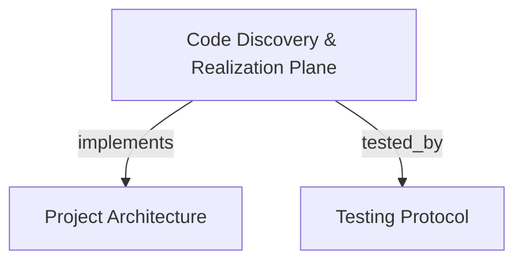

# Code Discovery & Realization Plane Inspection
Exposes symbol discovery, Cypher graph querying, call and data-flow tracing, code snippet extraction, architectural topologies, and ADR management over the persistent Realization Plane.

```graph
{
  "node_id": "feature:code-discovery",
  "domain": "code_discovery",
  "implements": ["adr:architecture"],
  "tested_by": ["adr:tests"],
  "entrypoints": [
    "src/mcp/handlers.c"
  ],
  "registration_files": [
    "src/mcp/mcp.c",
    "src/mcp/mcp_internal.h"
  ],
  "reference_files": [
    "src/mcp/compact_out.c",
    "src/mcp/compact_out.h"
  ],
  "code_files": [
    "src/core/cbm_uri.c",
    "src/core/cbm_uri.h",
    "src/store/store.c",
    "src/store/store.h"
  ],
  "test_files": [
    "tests/test_store_search.c",
    "tests/test_traces.c"
  ]
}
```

## OVERVIEW
The Code Discovery subsystem provides tools for querying and navigating the Realization Plane ("What is") in the codebase graph. It supports BM25 text queries, regex symbol pattern matching, Cypher graph traversals, AST declaration outlines, call graph tracing, and architectural summaries.

## FOLDER STRUCTURE
<folder_structure>
```
src/
├── core/                   # Canonical URI resolution and symbol identifier hashing
├── store/                  # Persistent SQLite storage for nodes, edges, and symbol bodies
└── mcp/                    # MCP JSON-RPC tool endpoints and federated handlers
    ├── handlers.c          # Federated discovery dispatch across base graph and active horizons
    └── compact_out.c       # Token-budgeted tree and JSON serialization formatting
```
</folder_structure>

## MAIN CONCEPTS

### Realization Plane Epistemic Grounding
In the `novos-paradgimas` workflow (PRD_V3 §1, §5), agents must ground their understanding of the Realization Plane before formulating changes. These tools fulfill Grounding Phase 1:
- **Symbolic Resolution**: Resolve symbol locations, signatures, and qualified names without brute-force filesystem grep.
- **Relational Traversal**: Trace inbound callers, outbound callees, and data flow to verify blast radius.
- **Evidence Tiers**: Form factual evidence (Scout, Verify, Auditor) directly from the graph database.

### Active Horizon Federation Overlay
When `active_horizons` IDs are supplied, discovery tools dynamically merge speculative nodes and virtual edges from ephemeral horizons over the immutable Base Graph.

## HOW TO EXECUTE CODE DISCOVERY

### Prerequisites
1. Ensure the target repository is indexed and ready in the project store.
2. Confirm the active project identifier via `list_projects` or `index_status`.

### Execution Flow
1. Find relevant symbols using `search_graph` or `search_code`.
2. Inspect declaration structure via `get_file_outline` or `get_code_snippet`.
3. Trace incoming and outgoing dependency paths using `trace_path`.
4. Run targeted Cypher aggregations or multi-hop relationship checks with `query_graph`.
5. Review architectural layers and cycles with `get_architecture`.

<code_example>
# CORRECT: Targeted symbol discovery and call graph traversal
search_graph(project="my-repo", name_pattern=".*PaymentHandler.*", format="tree")
trace_path(project="my-repo", function_name="PaymentHandler", direction="both", depth=3)
get_code_snippet(project="my-repo", qualified_name="services/payment.PaymentHandler", source_mode="auto")

# WRONG: Guessing source files or traversing dependencies without graph indexing
grep_filesystem("PaymentHandler") # Bypasses epistemic graph; misses indirect relations and token budgeting
</code_example>

## PARAMETERS / CONFIGURATIONS

| Tool | Parameters | Description | Default |
|---|---|---|---|
| `search_graph` | `project`, `query`, `name_pattern`, `qn_pattern`, `file_pattern`, `relationship`, `min_degree`, `max_degree`, `semantic_query`, `active_horizons`, `format`, `limit`, `max_output_tokens` | Find symbols via BM25, regex filters, or vector semantics with degree boundaries. | `limit=50`, `format="tree"`, `max_output_tokens=3200` |
| `search_code` | `project`, `pattern`, `file_pattern`, `path_filter`, `mode`, `context`, `regex`, `limit`, `result_limit`, `format` | Graph-ranked text and regex search returning compact symbols, full sources, or file paths. | `mode="compact"`, `limit=10`, `format="tree"` |
| `query_graph` | `project`, `query`, `graph`, `active_horizons`, `max_rows`, `cursor`, `format` | Read-only Cypher queries over code graph (`graph="code"`) or missed coverage file tree (`graph="missed"`). | `graph="code"`, `max_rows=200`, `format="tree"` |
| `trace_path` | `project`, `function_name`, `direction`, `depth`, `mode`, `parameter_name`, `edge_types`, `risk_labels`, `include_tests`, `active_horizons`, `cursor`, `limit` | Trace call chains (`calls`), data flow (`data_flow`), or service edges (`cross_service`). | `direction="both"`, `depth=3`, `mode="calls"`, `limit=100` |
| `get_code_snippet` | `project`, `qualified_name`, `source_mode`, `start_line`, `max_lines`, `include_neighbors`, `member_limit`, `format` | Extract bounded source code or member outlines for a symbol. `auto` mode outlines large containers (>200 lines). | `source_mode="auto"`, `member_limit=50`, `format="tree"` |
| `get_file_outline` | `project`, `file_path`, `labels`, `limit`, `offset`, `format` | Paged declaration outline of an exact file path, excluding file/folder container nodes. | `limit=100`, `format="tree"` |
| `get_graph_schema` | `project`, `diagnostics`, `limit`, `offset`, `format` | Inspect available node labels, edge types, and queryable property names. | `diagnostics="none"`, `limit=50`, `format="tree"` |
| `get_architecture` | `project`, `path`, `aspects`, `format` | Summarize architectural layers, hotspots, cycles, boundaries, routes, or dependency clusters. | `aspects=["overview"]`, `format="tree"` |
| `manage_adr` | `project`, `mode`, `content`, `section_updates`, `section_limit`, `format` | Outline, read, update, or rewrite specific sections of architectural decision records. | `mode="outline"`, `format="tree"` |

## BEST PRACTICES
REQUIRED: Prefer `search_graph` and `trace_path` over filesystem search to retrieve semantic relations and caller hierarchies.
REQUIRED: Supply `active_horizons` to discovery tools when validating speculative proposals against uncommitted horizon state.
REQUIRED: Use `get_code_snippet` with `source_mode="auto"` to avoid token budget exhaustion when reading large classes or modules.
PROHIBITED: Relying on absence of nodes in `query_graph(graph="missed")` as proof of completeness without running `check_index_coverage`.
PROHIBITED: Making code changes without tracing inbound callers to evaluate systemic blast radius.

## TIPS
Combine `get_architecture(aspects=["cycles", "hotspots"])` with `trace_path(mode="data_flow")` to pinpoint high-risk refactoring targets before modifying shared components.

<code_tip>
// Querying code schema properties before constructing complex Cypher queries
get_graph_schema(project="cbm-core", diagnostics="full")
query_graph(project="cbm-core", query="MATCH (f:Function)-[:CALLS]->(g:Function) WHERE f.degree > 10 RETURN f.name, g.name LIMIT 20")
</code_tip>

## DOCUMENT MAP



## REFERENCES

- [**ARCHITECTURE.md**](../adr/ARCHITECTURE.md): System layers, persistence model, and MCP server dispatch.
- [**TESTS.md**](../adr/TESTS.md): Test harness execution, search tests, and Cypher validation.
- [**multi_graph_federation.md**](./multi_graph_federation.md): Cognitive horizons and federated speculative overlays.
- [**index_governance.md**](./index_governance.md): Repository indexing, coverage checking, and change detection.
