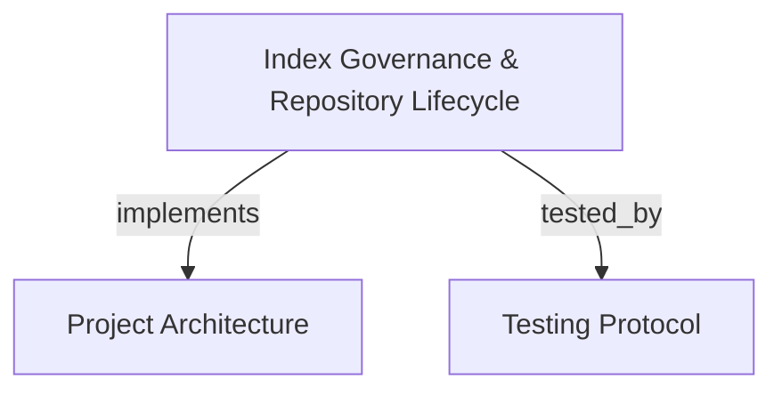

# Index Governance & Repository Lifecycle
Governs repository indexing, coverage verification, project lifecycle operations, git diff impact analysis, and runtime trace ingestion across the Realization Plane.

```graph
{
  "node_id": "feature:index-governance",
  "domain": "index_governance",
  "implements": ["adr:architecture"],
  "tested_by": ["adr:tests"],
  "entrypoints": [
    "src/mcp/index_supervisor.c"
  ],
  "registration_files": [
    "src/mcp/index_supervisor.h"
  ],
  "reference_files": [
    "src/pipeline/pipeline.h"
  ],
  "code_files": [
    "src/git/git_context.c",
    "src/pipeline/artifact.c",
    "src/pipeline/pass_gitdiff.c",
    "src/pipeline/pipeline.c"
  ],
  "test_files": [
    "tests/test_pipeline.c",
    "tests/test_scope_validator.c",
    "tests/test_watcher.c"
  ]
}
```

## OVERVIEW
The Index Governance subsystem manages the lifecycle and epistemic validity of repository graph databases. It handles repository ingestion, index readiness inspection, path coverage validation, project deletion, git diff impact detection, graph snapshot comparisons, and trace ingestion.

## FOLDER STRUCTURE
<folder_structure>
```
src/
├── git/                    # Git repository inspection and revision resolution
├── pipeline/               # AST parsing passes, artifact generation, and incremental indexing
└── mcp/                    # MCP supervisory tools and lifecycle endpoints
    ├── index_supervisor.c  # Supervisor coordination for background indexing and status
    └── mcp.c               # JSON-RPC tool registrations and argument validation
```
</folder_structure>

## MAIN CONCEPTS

### Axiom of Testimony & Coverage Verification
Per `novos-paradgimas` (PRD_V2, PRD_V3 §1, ADR_V1 §0), claims rendered by agents cannot rely on self-report. Before rendering exhaustive or negative claims (e.g. "symbol X does not exist" or "no callers found"), the agent must establish epistemic certainty:
- **`check_index_coverage`**: Validates whether specific file paths or directory scopes are indexed, stale, partial, or excluded.
- **`index_status`**: Queries database generation, node/edge counts, and unindexed file lists.

### Change Detection & Impact Analysis
- **`detect_changes`**: Analyzes git diffs against a base branch (`main`), computing inbound callers and outbound dependencies impacted by uncommitted or recent changes.
- **`compare_graphs`**: Compares two distinct indexed snapshots, surfacing added and removed nodes and edges deterministically.

## HOW TO EXECUTE INDEX GOVERNANCE

### Prerequisites
1. Ensure the target repository exists on the host filesystem.
2. Initialize background indexing through the MCP supervisor.

### Execution Flow
1. Check existing projects using `list_projects`.
2. Index a repository using `index_repository(repo_path="...", mode="full")`.
3. Inspect indexing status and coverage gaps via `index_status(project="...")`.
4. Validate cited paths using `check_index_coverage(project="...", paths=[...])`.
5. Evaluate git changes and impact radius via `detect_changes(project="...", base_branch="main")`.

<code_example>
# CORRECT: Verifying index coverage before asserting absence of dependencies
index_status(project="core-app", diagnostics="summary")
check_index_coverage(project="core-app", paths=["src/auth/service.c", "src/auth/token.c"])
detect_changes(project="core-app", base_branch="main", scope="impact")

# WRONG: Asserting zero callers without validating path indexing coverage
// Agent assumes zero callers solely because search returned empty, ignoring unindexed files
search_graph(project="core-app", name_pattern="LegacyAuthToken")
</code_example>

## PARAMETERS / CONFIGURATIONS

| Tool | Parameters | Description | Default |
|---|---|---|---|
| `index_repository` | `repo_path`, `mode`, `target_projects`, `name`, `persistence` | Index a repository. Modes: `full` (all+semantic), `moderate` (filtered+semantic), `fast` (filtered), `cross-repo-intelligence` (link services). | `mode="full"`, `persistence=false` |
| `index_status` | `project`, `diagnostics`, `verbose`, `format` | Check indexing readiness, node/edge counts, root path, and coverage gap samples. Diagnostics: `none`, `summary`, `full`. | `diagnostics="none"`, `format="tree"` |
| `check_index_coverage` | `project`, `paths`, `scopes`, `path_limit`, `scope_limit`, `diagnostics`, `format` | Validate exact path coverage and freshness. Reports parsed, partial, excluded, or stale files. | `path_limit=20`, `diagnostics="none"`, `format="tree"` |
| `list_projects` | `detail`, `include_details`, `limit`, `offset`, `format` | List indexed projects. `detail="stats"` includes node/edge counts and database size. | `detail="identity"`, `limit=50`, `format="tree"` |
| `delete_project` | `project` | Delete an indexed project and associated SQLite storage files from disk. | — |
| `detect_changes` | `project`, `scope`, `direction`, `depth`, `base_branch`, `since`, `limit`, `format` | Map git diff to changed files and compute inbound caller or outbound dependency impact. | `scope="impact"`, `direction="inbound"`, `depth=2`, `base_branch="main"` |
| `compare_graphs` | `base_project`, `target_project`, `limit`, `scan_limit` | Compare two indexed snapshots, returning deterministic added and removed nodes and edges. | `limit=200`, `scan_limit=2000000` |
| `ingest_traces` | `project`, `traces` | Ingest runtime caller-callee execution traces into the project graph model. | — |

## BEST PRACTICES
REQUIRED: Execute `check_index_coverage` on all target paths before concluding an implementation is absent or unreferenced.
REQUIRED: Run `detect_changes` with `direction="both"` prior to submitting changes for review to identify transitive breakage.
REQUIRED: Use `mode="cross-repo-intelligence"` when indexing microservices to enable cross-boundary dependency resolution.
PROHIBITED: Relying on positive search results from stale project indexes without re-indexing or verifying freshness.
PROHIBITED: Deleting active projects during ongoing cognitive session horizons.

## TIPS
Run `compare_graphs` between the current working branch index and the base branch index to generate an automated diff summary for PR reviews.

<code_tip>
// Checking coverage for changed files before building refactoring plans
detect_changes(project="cbm-engine", scope="files")
check_index_coverage(project="cbm-engine", paths=["src/mcp/handlers.c", "src/mcp/mcp.c"])
</code_tip>

## DOCUMENT MAP



## REFERENCES

- [**ARCHITECTURE.md**](../adr/ARCHITECTURE.md): System architecture, indexing pipeline, and daemon reaper.
- [**TESTS.md**](../adr/TESTS.md): Test harness execution, pipeline tests, and watcher validation.
- [**code_discovery.md**](./code_discovery.md): Symbol discovery, Cypher querying, and code snippet inspection.
- [**multi_graph_federation.md**](./multi_graph_federation.md): Ephemeral horizons and speculative federation.
