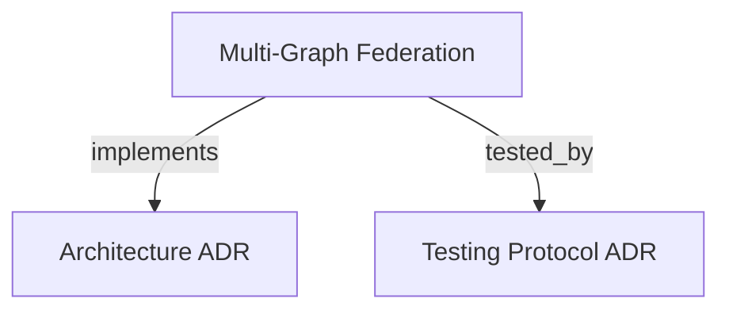

# Multi-Graph Federation
Coordinates ephemeral cognitive horizon overlays and multi-graph federation over the persistent base graph.

```graph
{
  "node_id": "feature:multi-graph-federation",
  "domain": "multi_graph_federation",
  "implements": ["adr:architecture"],
  "tested_by": ["adr:tests"],
  "entrypoints": [
    "src/mcp/mcp.c"
  ],
  "registration_files": [
    "src/mcp/handlers.c",
    "src/mcp/mcp_internal.h",
    "src/mcp/promote_handler.c"
  ],
  "reference_files": [
    "src/core/cbm_uri.c",
    "src/core/cbm_uri.h"
  ],
  "code_files": [
    "src/admission/admission_gate.c",
    "src/admission/admission_gate.h",
    "src/admission/anchor_checker.c",
    "src/admission/anchor_checker.h",
    "src/admission/recall_engine.c",
    "src/admission/recall_engine.h",
    "src/core/horizon_pool.c",
    "src/core/horizon_pool.h",
    "src/core/symbolic_node.c",
    "src/core/symbolic_node.h",
    "src/core/visited_set.h",
    "src/daemon/horizon_reaper.c",
    "src/daemon/horizon_reaper.h",
    "src/db/horizon_schema.sql",
    "src/query/kway_merge.c",
    "src/query/kway_merge.h"
  ],
  "test_files": [
    "tests/test_anchor_checker.c",
    "tests/test_cbm_uri.c",
    "tests/test_horizon_reaper.c",
    "tests/test_kway_merge.c",
    "tests/test_mcp_federation.c",
    "tests/test_multi_graph_federation.py",
    "tests/test_recall_engine.c"
  ]
}
```

## OVERVIEW
Multi-Graph Federation enables speculative overlays on top of the immutable Base Graph. It isolates uncommitted cognitive horizons in separate SQLite databases, provides streaming K-way merge queries, enforces two-tier anchor admission checks, and propagates reverse epistemic recall when anchors drift.

## ARCHITECTURE & WORKFLOW

### Architectural Components
- **Addressing & Identity**: Uses canonical `cbm://<repo>/<path>#<symbol>` URIs hashed with 64-bit FNV-1a.
- **Connection Management**: `HorizonConnectionPool` bounds open SQLite file descriptors to 16 using LRU eviction.
- **Query Federation**: Streaming `KWayMergeContext` merges ordered streams using a min-heap with $O(K)$ memory footprint.
- **Admission Gate**: `AdmissionGate` verifies source code stability before merging horizon state into the Base Graph.
- **Epistemic Recall**: `EpistemicRecallService` computes reverse dependency closures ($deps^{-1}$) up to depth 5.
- **Orphan Reclamation**: `HorizonReaperService` unlinks stale horizon databases exceeding 1-hour TTL when client PID terminates.

### Operational Workflow
1. Initialize horizon database via `cbm_create_horizon` with client PID ownership.
2. Insert proposed symbolic nodes and virtual edges into the horizon overlay.
3. Query federation via `active_horizons[]` in `query_graph`, `search_graph`, and `trace_path`.
4. Validate filesystem anchors via `cbm_verify_two_tier_anchor` before promoting.
5. On drift, execute `cbm_trigger_recall` to mark affected symbols as contested.

## FOLDER STRUCTURE
<folder_structure>
```
src/
├── core/                   # CBM-URI parser, horizon connection pool LRU, symbolic node CRUD
├── query/                  # Streaming K-way merge iterator and min-heap ordering
├── admission/              # Two-tier anchor validation, admission gate, and reverse recall engine
├── daemon/                 # Horizon reaper background worker and PID liveness validation
├── db/                     # Horizon SQLite schema DDL and indexes
└── mcp/                    # MCP JSON-RPC handlers for federated query and promotion
```
</folder_structure>

## KEY INTERFACES

### Horizon Acquisition & Query
<code_example>
# CORRECT: Retrieve horizon SQLite handle via LRU bounded connection pool
sqlite3 *h_db = NULL;
if (cbm_horizon_pool_get(&pool, horizon_id, &h_db) == CBM_URI_OK) {
    cbm_symbolic_node_find(h_db, uri_str, &node, snippet, sizeof(snippet));
}

# WRONG: Direct SQLite connection bypassing connection pool LRU ceiling
sqlite3 *h_db = NULL;
sqlite3_open_v2("horizon.db", &h_db, SQLITE_OPEN_READWRITE, NULL);
</code_example>

### Admission & Anchor Verification
<code_example>
# CORRECT: Verify two-tier anchors before executing horizon promotion
bool ok = false;
cbm_verify_two_tier_anchor(root_dir, &anchor, &ok);
if (ok) {
    cbm_promote_horizon(&gate, &pool, root_dir, horizon_id, &anchor, 1, err, sizeof(err));
}

# WRONG: Promote speculative horizon without two-tier anchor verification
cbm_promote_horizon_state(&pool, horizon_id);
</code_example>

## PARAMETERS / CONFIGURATIONS

| Parameter | Type | Default | Description |
|---|---|---|---|
| `CBM_MAX_HORIZON_FDS` | int | 16 | Maximum simultaneous open SQLite handles in connection pool |
| `CBM_HORIZON_TTL_SECONDS` | int | 3600 | TTL duration before orphan horizons with dead PIDs are reaped |
| `CBM_MAX_TRAVERSAL_DEPTH` | int | 5 | Maximum traversal depth for reverse recall and BFS graph exploration |
| `CBM_VISITED_CAP` | int | 2048 | Maximum capacity of VisitedSet 64-bit FNV-1a hash array |
| `CBM_MAX_MERGE_STREAMS` | int | 32 | Maximum simultaneous cursors merged in KWayMergeContext |

## BEST PRACTICES
REQUIRED: Bound all horizon SQLite access through `HorizonConnectionPool` to prevent OS file descriptor exhaustion.
REQUIRED: Execute two-tier anchor checks (byte offset with AST hash fallback) prior to promoting any horizon.
REQUIRED: Guard all graph traversals with `VisitedSet` to prune cycles and prevent infinite loops.
FORBIDDEN: Mutating the Base Graph directly during speculative horizon exploration.
FORBIDDEN: Admitting horizons with drifted anchors or unverified symbols.

## DOCUMENT MAP



## REFERENCES

- [**ARCHITECTURE.md**](../adr/ARCHITECTURE.md): Multi-graph federation architecture, layers, and storage models.
- [**TESTS.md**](../adr/TESTS.md): Test execution protocol, unit suites, and federation regression harness.
