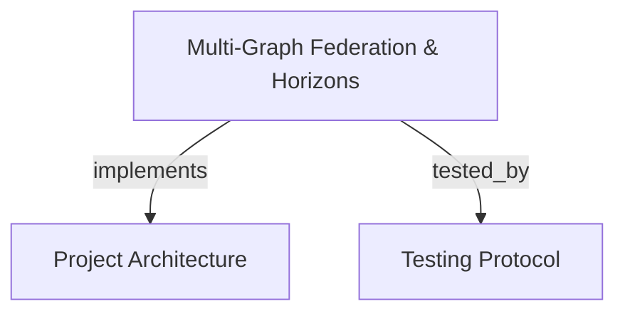

# Multi-Graph Federation & Cognitive Horizons
Coordinates ephemeral cognitive horizon overlays, speculative graph modeling, AST anchor verification, and admission gate promotion over the persistent base graph.

```graph
{
  "node_id": "feature:multi-graph-federation",
  "domain": "multi_graph_federation",
  "implements": ["adr:architecture"],
  "tested_by": ["adr:tests"],
  "entrypoints": [
    "src/mcp/horizon_handler.c"
  ],
  "registration_files": [
    "src/mcp/horizon_sync_handler.c",
    "src/mcp/horizon_sync_handler.h"
  ],
  "reference_files": [
    "src/core/horizon_pool.c",
    "src/core/horizon_pool.h"
  ],
  "code_files": [
    "src/admission/admission_gate.c",
    "src/admission/admission_gate.h",
    "src/admission/anchor_checker.c",
    "src/admission/anchor_checker.h",
    "src/admission/recall_engine.c",
    "src/admission/recall_engine.h",
    "src/core/symbolic_node.c",
    "src/core/symbolic_node.h",
    "src/core/visited_set.h",
    "src/daemon/horizon_reaper.c",
    "src/daemon/horizon_reaper.h",
    "src/db/horizon_schema.sql",
    "src/mcp/promote_handler.c",
    "src/query/kway_merge.c",
    "src/query/kway_merge.h"
  ],
  "test_files": [
    "tests/test_anchor_checker.c",
    "tests/test_cbm_uri.c",
    "tests/test_horizon_reaper.c",
    "tests/test_kway_merge.c",
    "tests/test_mcp_federation.c",
    "tests/test_multi_graph_federation.py",
    "tests/test_recall_engine.c",
    "tests/test_union_workflow_e2e.c"
  ]
}
```

## OVERVIEW
Multi-Graph Federation allows agents to deliberate in isolated, speculative overlays on top of the immutable Base Graph. It exposes MCP tools to create ephemeral horizons, compile tactical markdown specifications into graph nodes, validate scope connectivity, and admit verified state via two-tier AST anchors.

## FOLDER STRUCTURE
<folder_structure>
```
src/
├── core/                   # CBM-URI addressing, LRU connection pool, and symbolic nodes
├── admission/              # Two-tier AST anchor verification and promotion admission gate
├── query/                  # Streaming K-way merge iterator for federated queries
├── daemon/                 # Horizon reaper service for PID liveness and TTL cleanup
└── mcp/                    # Horizon MCP handlers for lifecycle, spec sync, and promotion
```
</folder_structure>

## MAIN CONCEPTS

### Cognitive Horizons in Novos Paradigmas
In the `novos-paradgimas` workflow (ADR_V1 §2, §3, AUDIT-WORKFLOW §1, §6):
- **Speculative Deliberation**: Agents must never mutate the Base Graph directly while exploring hypotheses. Horizons isolate uncommitted symbolic nodes and virtual edges in dedicated SQLite databases.
- **Federated Discovery**: Passing `active_horizons` to `search_graph`, `query_graph`, and `trace_path` transparently overlays speculative definitions onto base code.
- **Two-Tier AST Anchors**: Anchors pin source code locations using byte offsets with AST hash fallbacks. Promotion succeeds only if the underlying source code remains unchanged.
- **Promotion input lengths**: The MCP handler rejects negative, non-integer, out-of-range, oversized, or text-length-mismatched anchor lengths before hashing. It accepts at most 511 path bytes, 255 symbol bytes, and 1,023 expected-text bytes; a zero `byte_len` with supplied text uses that text's byte length. Anchor-count and total-request limits remain unspecified.
- **Promotion preconditions**: The admission gate refuses an empty anchor set and an unavailable base database before changing the horizon status. The handler returns `INVALID_PARAMS` or `BASE_UNAVAILABLE` for those cases.
- **Scope Connectivity**: Strict connectivity checks reject orphan or disconnected speculative nodes before admission.

## HOW TO EXECUTE COGNITIVE HORIZONS

### Prerequisites
1. Ensure the base project is indexed and accessible in the pool directory.
2. Formulate speculative changes or prepare tactical markdown specifications.

### Execution Flow
1. Create or update an ephemeral horizon overlay using `create_horizon` or `sync_horizon_spec`.
2. Inspect federated state by passing `active_horizons=[horizon_id]` to discovery tools.
3. Validate structural consistency using `validate_scope_horizon`.
4. Admit the horizon into the Base Graph via `promote_horizon` with concrete Two-Tier anchors.

<code_example>
# CORRECT: Ephemeral horizon creation, validation, and anchor-gated promotion
create_horizon(
    horizon_id="h_payment_split",
    project="cbm-core",
    nodes=[{"cbm_uri": "cbm://core/payment.c#split_fee", "label": "Function", "epistemic_status": "PROPOSED"}],
    edges=[{"source_uri": "cbm://core/payment.c#split_fee", "target_uri": "cbm://core/math.c#calc_ratio", "edge_type": "CALLS"}]
)
validate_scope_horizon(horizon_id="h_payment_split", strict_connectivity=true)
promote_horizon(
    horizon_id="h_payment_split",
    anchors=[{"file_path": "src/payment.c", "symbol_name": "split_fee", "byte_start": 1024, "byte_len": 128, "ast_signature_hash": 987654321}]
)

# WRONG: Direct mutation of base graph or promotion without anchor verification
promote_horizon(horizon_id="h_payment_split", anchors=[]) // Bypasses drift verification
</code_example>

## PARAMETERS / CONFIGURATIONS

| Tool | Parameters | Description | Default |
|---|---|---|---|
| `create_horizon` | `horizon_id`, `project`, `nodes`, `edges` | Allocate or update an ephemeral cognitive horizon with speculative nodes (`cbm_uri`, `label`, `epistemic_status`, `is_dangling`, `code_snippet`) and virtual edges (`source_uri`, `target_uri`, `edge_type`). | — |
| `sync_horizon_spec` | `horizon_id`, `file_path`, `content`, `project` | Sync and compile tactical markdown specifications directly into ephemeral horizon graph nodes. | — |
| `validate_scope_horizon` | `horizon_id`, `strict_connectivity` | Validate scope adjacency and detect isolated dangling nodes in a horizon overlay. | `strict_connectivity=true` |
| `promote_horizon` | `horizon_id`, `anchors` | Validate Two-Tier AST anchors and admit a cognitive horizon into the persistent Base Graph. Anchors verify `file_path`, `symbol_name`, byte boundaries, and AST signature hash. | — |

## BEST PRACTICES
REQUIRED: Bind all speculative proposals to a named `horizon_id` before modifying shared architectural components.
REQUIRED: Run `validate_scope_horizon` with `strict_connectivity=true` prior to promotion to avoid introducing dangling graph edges.
REQUIRED: Supply concrete Two-Tier AST anchors with `ast_signature_hash` when calling `promote_horizon`.
REQUIRED: Supply at least one anchor and an available persistent base database before promotion.
PROHIBITED: Bypassing Two-Tier anchor verification during horizon promotion.
PROHIBITED: Leaving speculative horizons active indefinitely without promotion or session closure.

## TIPS
Use `sync_horizon_spec` to automatically translate written architectural markdown specs into queryable speculative graph nodes before writing implementation code.

<code_tip>
// Compiling a tactical spec into an ephemeral horizon for validation
sync_horizon_spec(horizon_id="h_spec_review", file_path="docs/PRD/specs/SCOPE-A01.md")
validate_scope_horizon(horizon_id="h_spec_review", strict_connectivity=true)
</code_tip>

## DOCUMENT MAP



## REFERENCES

- [**ARCHITECTURE.md**](../adr/ARCHITECTURE.md): Multi-graph federation architecture, connection pools, and admission gate.
- [**TESTS.md**](../adr/TESTS.md): Test harness execution, anchor checker tests, and E2E federation suite.
- [**code_discovery.md**](./code_discovery.md): Discovery tools supporting `active_horizons` speculative overlay.
- [**union_workflow.md**](./union_workflow.md): Cognitive session horizons, effect gateways, and caller-blind contestations.
