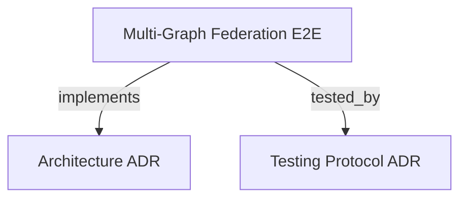

# Multi-Graph Federation End-to-End Test Suite
Validates black-box MCP stdio JSON-RPC protocol compliance, multi-agent horizon isolation, two-tier anchor refactoring admission, and client crash recovery with daemon horizon reaping.

```graph
{
  "node_id": "feature:multi-graph-federation-e2e",
  "domain": "multi_graph_federation_e2e",
  "implements": ["adr:architecture"],
  "tested_by": ["adr:tests"],
  "entrypoints": [
    "tests/e2e/run_e2e.py"
  ],
  "registration_files": [
    "tests/e2e/mcp_process_driver.py",
    "tests/e2e/jsonrpc_client.py"
  ],
  "reference_files": [
    "tests/e2e/sandbox_environment.py",
    "tests/e2e/reaper_harness.py",
    "tests/e2e/federated_engine.py",
    "tests/e2e/admission_verifier.py"
  ],
  "code_files": [
    "tests/e2e/fixtures/base_seeder.py",
    "tests/e2e/fixtures/specimens.py",
    "tests/e2e/fixtures/harness_specimen.py"
  ],
  "test_files": [
    "tests/e2e/test_protocol_handshake.py",
    "tests/e2e/test_multi_agent_isolation.py",
    "tests/e2e/test_refactoring_admission.py",
    "tests/e2e/test_crash_recovery_reaper.py",
    "tests/e2e/test_streaming_pagination.py"
  ]
}
```

## OVERVIEW
Black-box E2E validation framework communicating with the native `codebase-memory-mcp` binary via standard I/O pipes using JSON-RPC 2.0. Exercises multi-agent cognitive horizon isolation, real-world AST anchor verification, and atomic Base Graph SQLite consolidation without Python mocks.

## FOLDER STRUCTURE
<folder_structure>
```
tests/e2e/
├── fixtures/                  # Deterministic Base/Horizon seeders and realistic source specimens
├── drivers/                   # MCP subprocess managers and JSON-RPC 2.0 framing drivers
├── harnesses/                 # Process supervision, reaper simulation, and K-way merge engines
└── scenarios/                 # Isolated test scenarios (handshake, isolation, admission, reaping)
```
</folder_structure>

## ARCHITECTURE & SYSTEM INTEGRATION
- References: [Architecture Guide](../adr/ARCHITECTURE.md), [Testing Protocol](../adr/TESTS.md).
- **Subprocess Driver**: Spawns native `codebase-memory-mcp` binary communicating over `stdin`/`stdout` pipes with dedicated daemon reader threads, timeout protection (15.0s for virtualized/WSL environments), and clean process tree termination (`taskkill /F /T` / `SIGKILL`).
- **Hermetic Sandbox**: Generates isolated project scopes with dedicated `.db` namespaces, preventing collisions with active background daemons.
- **Two-Tier Anchor Verification**: Verifies fast-path SHA-256 byte hashes on disk followed by Tree-Sitter AST symbol signature comparison when comments or whitespaces shift lines. Rejects breaking mutations with `ANCHOR_DRIFT`.
- **Realistic Specimens (`harness_specimen.py`)**: Generates TypeScript structures matching production SDKs (`harness-kit/sdk/src/agent-runner/IAgentRunner.ts`), validating multi-OS path resolution (`repo_path` relative and absolute paths).
- **Horizon Reaper Verification**: Spawns real OS client processes, terminates them forcibly, and validates deterministic removal of `.db`, `.db-wal`, and `.db-shm` files without lock leakage.
- **Streaming K-Way Merge**: Implements Min-Heap merging with priority shadowing across Base and Horizon databases over multiple paginated steps.

## TEST COVERAGE
Run the complete suite:
```bash
python tests/e2e/run_e2e.py
```

Coverage includes 12 automated real-world scenarios with 100% pass rate:
- Protocol handshake, capabilities negotiation, and tool catalog reflection (`test_protocol_handshake.py`).
- Concurrent multi-agent cognitive horizon isolation and private symbol invisibility (`test_multi_agent_isolation.py`).
- Two-Tier anchor verification: exact match, benign comment shift, and signature drift rejection (`test_refactoring_admission.py`).
- Multi-OS path resolution and dynamic Base Graph SQLite consolidation (`test_refactoring_admission.py`).
- Client crash detection and orphan SQLite database cleanup by the background reaper (`test_crash_recovery_reaper.py`).
- Paginated K-Way merge with node shadowing across horizons (`test_streaming_pagination.py`).

## DOCUMENT MAP



## REFERENCES

- [**ARCHITECTURE.md**](../adr/ARCHITECTURE.md): Multi-graph federation architecture, layers, and storage models.
- [**TESTS.md**](../adr/TESTS.md): Test execution protocol, unit suites, and federation regression harness.
- [**multi_graph_federation.md**](./multi_graph_federation.md): Multi-graph federation feature specification and source routing.
