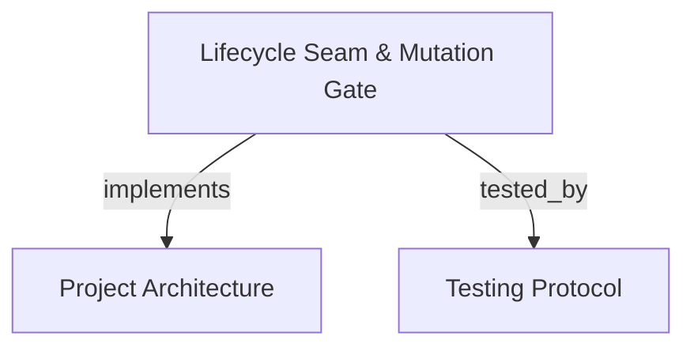

# Lifecycle Seam & Repository Mutation Gate

Governs the physical boundary between agent deliberation and filesystem modification across Google Antigravity and OpenAI Codex hosts, enforcing strict `intent_scope` whitelists and durable mutation journals.

```graph
{
  "node_id": "feature:mutation-gate",
  "domain": "mutation_gate",
  "implements": ["adr:architecture"],
  "tested_by": ["adr:tests"],
  "entrypoints": [
    "src/cli/hook_augment.c",
    "src/main.c"
  ],
  "registration_files": [
    "src/cli/cli.c",
    "src/mcp/union_handler.c"
  ],
  "reference_files": [
    "src/union/mutation_gate.c",
    "src/union/mutation_gate.h"
  ],
  "code_files": [
    "src/union/mutation_journal.c",
    "src/union/mutation_journal.h",
    "src/cli/config_toml_edit.c"
  ],
  "test_files": [
    "tests/test_cli.c",
    "tests/test_union_session.c",
    "tests/test_config_toml_edit.c"
  ]
}
```

## OVERVIEW
The Mutation Gate subsystem implements the **Cognitive Respiration Seam** (SCOPE-E01). It connects native IDE lifecycle hooks (Antigravity's `PreToolUse` and Codex's `pre_tool_use`) with the CBM Union engine. It guarantees that autonomous agents cannot write, modify, delete, or rename repository files without an active session horizon whose `intent_scope` explicitly covers those exact paths.

## FOLDER STRUCTURE
<folder_structure>
```
src/
├── union/                  # Core gate evaluation, intent scoping, and durable journal
│   ├── mutation_gate.c     # Path canonicalization and scope matching logic
│   ├── mutation_gate.h     # Gate verdict enums and struct definitions
│   ├── mutation_journal.c  # SQLite WAL durable intent logging and recovery
│   └── mutation_journal.h  # Journal entry structs and prototypes
└── cli/                    # Host hook adapters and CLI augmentation
    ├── hook_augment.c      # Hook installation and configuration generator
    └── config_toml_edit.c  # Atomic Codex config.toml patcher
```
</folder_structure>

## MAIN CONCEPTS

### The Mutation Seam
- **Passive Reads**: All discovery, inspection, and graph queries execute without gate interference.
- **Physical Mutation Limiar**: When an agent invokes file mutation tools (`write_to_file`, `replace_file_content`), the host hook intercepts the execution before touching disk.
- **Intent Scope Whitelist**: Sessions must explicitly declare 1 to 4 exact path and operation pairs (`create`, `modify`, `delete`, `rename`). Any target outside this whitelist is vetoed immediately.
- **Atomicity of Multi-File Patches**: In tools like `apply_patch`, if any single file among the targets is outside the session's `intent_scope`, the entire patch is refused atomically before any file is touched.

### Host Hook Contracts

| Host | Configuration Location | Event Intercepted | Denial Protocol |
| :--- | :--- | :--- | :--- |
| **Google Antigravity** | `~/.gemini/antigravity/hooks.json` or `.agents/hooks.json` | `PreToolUse` | Returns JSON `{"decision": "deny", "reason": "..."}` |
| **OpenAI Codex** | `~/.codex/config.toml` or `.codex/hooks.json` | `pre_tool_use` | Returns JSON with `hookSpecificOutput.permissionDecision: deny` |

### Path Canonicalization & Boundary Rules
- **Workspace Confinement**: All paths are resolved to canonical absolute paths via `cbm_path_within_root`. Traversal escapes (`../`) are detected and rejected.
- **Intermediate Directories**: When creating files in nested directories that do not yet exist, intermediate path canonicalization resolves safely to the closest existing ancestor within workspace boundaries.
- **Renames**: A rename requires two explicit scope declarations: one for the source path (`delete` or `rename`) and one for the destination path (`create` or `rename`).

## HOW TO CONFIGURE & RUN THE MUTATION GATE

### 1. Augment Host Configuration via CLI
The CBM binary provides automated hook installation commands:
```bash
# Augment Antigravity hooks
cbm hook-augment --host antigravity

# Augment Codex config.toml
cbm hook-augment --host codex
```

### 2. Manual Evaluation via CLI
For testing hook integration, evaluate tool inputs via stdin:
```bash
echo '{"tool_name": "write_to_file", "tool_input": {"TargetFile": "src/main.c"}}' | cbm hook-eval --host antigravity --stdin
```

<code_example>
# Session opening with explicit 2-path whitelist
union_session_open(
    identity="developer-backend",
    contract_id="c_strict_tdd",
    based_on_seq="gen_2026_09_30",
    client_id="conv_86bef9aa",
    intent_scope=[
        {"path": "c:/Users/corre/Documents/codebase-memory-mcp/tests/test_auth.c", "operation": "create"},
        {"path": "c:/Users/corre/Documents/codebase-memory-mcp/src/auth/auth_service.c", "operation": "create"}
    ]
)

# Authorized file modification (within scope):
write_to_file(TargetFile="c:/Users/corre/Documents/codebase-memory-mcp/src/auth/auth_service.c", CodeContent="...")

# Vetoed file modification (outside scope -> hook blocks execution):
write_to_file(TargetFile="c:/Users/corre/Documents/codebase-memory-mcp/src/unauthorized.c", CodeContent="...")
</code_example>

## TELEMETRY & REPORTING
The gate maintains a strict separation in session telemetry:
- `refusals`: Semantic Union gateway refusals (e.g. effect budget exceeded, contract violation).
- `hook_refusals`: Durable host hook vetoes recorded in `mutation_hook_refusal_journal`.
Both counters are queryable via `union_session_get` and validated during `union_session_close`.

## DOCUMENT MAP



## REFERENCES
- [**ARCHITECTURE.md**](../adr/ARCHITECTURE.md): System architecture and layer breakdown.
- [**TESTS.md**](../adr/TESTS.md): Test suites and coverage requirements.
- [**ADR-001-COGNITIVE-RESPIRATION.md**](../adr/ADR-001-COGNITIVE-RESPIRATION.md): Respiration architecture decision.
- [**union_workflow.md**](./union_workflow.md): The 14 Union tools and epistemic governance.
