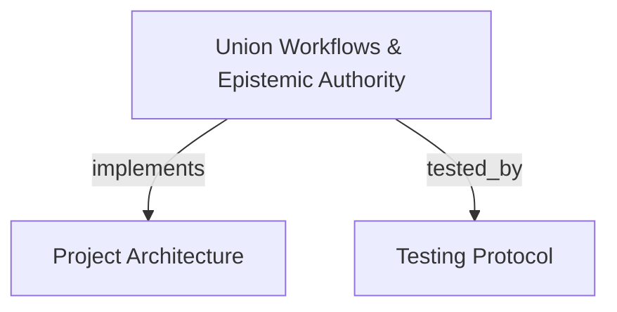

# Union Cognitive Workflows & Epistemic Authority
Coordinates session horizons, skill contract registries, effect-class gateways, thematic knowledge base bindings, caller-blind contestations, and founding proposals.

```graph
{
  "node_id": "feature:union-workflow",
  "domain": "union_workflow",
  "implements": ["adr:architecture"],
  "tested_by": ["adr:tests"],
  "entrypoints": [
    "src/mcp/union_handler.c",
    "src/cli/hook_augment.c"
  ],
  "registration_files": [
    "src/mcp/mcp.c",
    "src/cli/cli.c"
  ],
  "reference_files": [
    "src/union/union_session.c",
    "src/union/mutation_gate.c"
  ],
  "code_files": [
    "src/union/union_binding.c",
    "src/union/union_claim.c",
    "src/union/union_contest.c",
    "src/union/union_founding.c",
    "src/union/union_gateway.c",
    "src/union/union_routing.c",
    "src/union/union_sweep.c",
    "src/union/union_theme_registry.c",
    "src/union/union_trace.c",
    "src/union/mutation_gate.h",
    "src/union/mutation_journal.c",
    "src/union/mutation_journal.h",
    "src/cli/config_toml_edit.c"
  ],
  "test_files": [
    "tests/test_union_contest.c",
    "tests/test_union_founding.c",
    "tests/test_union_workflow_e2e.c",
    "tests/test_union_session.c",
    "tests/test_cli.c",
    "tests/test_config_toml_edit.c"
  ]
}
```

## OVERVIEW
The Union subsystem implements the cognitive workflow and epistemic authority layer derived from `docs/PRD/novos-paradgimas` (Track W). It exposes 14 MCP tools governing intent classification, provenance validation, thematic knowledge base registry, normative/consulted bindings, session horizons, conversational claim birth/sweep, effect-class gateways, caller-blind contestation, and theme founding.

## FOLDER STRUCTURE
<folder_structure>
```
src/
├── union/                  # Core session horizons, effect gateways, craft themes, and sweep
└── mcp/                    # MCP JSON-RPC tool endpoints for union workflows
    ├── union_handler.c     # Handlers for sessions, gateway, themes, contest, sweep, and founding
    └── union_handler.h     # Handler prototypes for Track W tools
```
</folder_structure>

## MAIN CONCEPTS

### The Workflow Lifecycle in Novos Paradigmas
The 14 tools follow the canonical station lifecycle specified in AUDIT-WORKFLOW §6:
1. **Routing**: `classify_activity` routes intent to `CONSULTATIVE` or `SPECIALTY`.
2. **Grounding**: Query themes via `theme_lookup` (`ABSENT` is queryable), register via `theme_register`, and check bindings via `binding_claim`.
3. **Session Deliberation**: `union_session_open` binds session to contract/identity. Craft judgment requires `validate_provenance`.
4. **Execution Gateway**: `union_record_action` gates actions (`IDEMPOTENT`, `COMPENSABLE`, `IRREVERSIBLE`).
5. **Caller-Blind Contestation**: `contest_verify` permits evidence-backed review (`target_horizon` and delimiter scoping isolate targets). Unresolved blocking contestations halt promotion.
6. **Sweep & Harvesting**: Conversational claims are captured via `union_claim_capture` and resolved via `union_claim_resolve` (strictly rejected outside active open sessions). `union_session_close` blocks on unresolved claims (`SWEEP_INCOMPLETE`) and emits a factual trace logged to the host. Inventions are proposed via `founding_propose` (persisted to `<cache>/founding_proposals.json` with capacity guard) and adjudicated via `founding_decide` (requiring host-proven operator authority).

## HOW TO EXECUTE UNION WORKFLOWS

### Execution Flow
1. Classify intent using `classify_activity`.
2. Inspect or register craft themes using `theme_lookup` or `theme_register`.
3. Bind architecture to craft standards using `binding_claim`.
4. Open an authenticated session horizon via `union_session_open`.
5. Capture and resolve conversational claims via `union_claim_capture` and `union_claim_resolve`.
6. Authorize actions via `union_record_action`.
7. Submit contestations via `contest_verify` when evidence disputes claims.
8. Close the session horizon with `union_session_close` and submit proposals via `founding_propose`.

<code_example>
# Session lifecycle with claim capture, resolution, gateway, and closure
classify_activity(intent="Refactor payment gateway with DDD clean architecture")
union_session_open(identity="developer", contract_id="c_dev_standard", based_on_seq="gen_2026_09")
union_claim_capture(horizon_id="h_01", claim_id="c_01", type="DECISION", predicate="Split payment gateway.")
union_claim_resolve(horizon_id="h_01", claim_id="c_01", destination="PROMOTED", validator_identity="operator")
union_record_action(horizon_id="h_01", action_name="update_handler", effect_class="COMPENSABLE", idempotency_key="k1")
union_session_close(horizon_id="h_01", reason="NORMAL")
</code_example>

### E01 Repository Mutation Gate

Antigravity and Codex hooks share one gate. Reads have no Union or journal effects; repository writes and unknown tools need grounded authority and durable intent. Outside writes are exempt. SQLite shares session bindings with short-lived hooks.

Bind `union_session_open` with host context, grounding kind, intent key, a reference or rationale, and `intent_scope`. The scope contains one to four exact absolute path and operation pairs (`create`, `modify`, `delete`, or `rename`); the gate canonicalizes each path and refuses writes outside those pairs. Use Antigravity `conversationId` or Codex `session_id`; rebinds fail.

For example, `intent_scope=[{"path":"/repo/src/handler.c","operation":"modify"}]` authorizes only a modification to that file. A single-file `apply_patch` can use this scope. Multi-file patches, renames, and commands whose targets cannot be proven are refused.

Intent commits before permit. Unobserved outcomes become `UNKNOWN` on close or recovery.

| Host | Hook input identity | Denial output | Install location |
|---|---|---|---|
| Antigravity | `conversationId`, `toolCall.name/args`, `workspacePaths` | `decision: deny` with `reason` | `~/.gemini/antigravity/hooks.json` |
| Codex | `session_id`, `tool_name`, `tool_input`, `cwd` | `hookSpecificOutput` with `permissionDecision: deny` | `~/.codex/config.toml` or `~/.codex/hooks.json` |

The adapter denies at 25 seconds, before its 30-second timeout. Codex trust and tool-path opt-outs limit coverage; hooks are not an OS boundary. Unknown commands without a proven target are refused.

Consultation creates no Union session or gate action. Read APIs may refresh indexes or caches.

## PARAMETERS / CONFIGURATIONS

| Tool | Parameters | Description | Default |
|---|---|---|---|
| `classify_activity` | `intent` | Classify intent into `CONSULTATIVE` or `SPECIALTY`. | — |
| `validate_provenance` | `theme_id`, `node_uri`, `pinned_version`, `declared_invention`, `rationale` | Validate provenance; refuses silent invention. | — |
| `theme_lookup` | `theme_id` | Query theme registry (`ABSENT` is queryable). | — |
| `theme_register` | `theme_id`, `namespace`, `curator`, `version`, `status` | Register theme (`ACTIVE` or `ABSENT`). | `status="ACTIVE"` |
| `binding_claim` | `claim_id`, `theme_id`, `pinned_version`, `mode`, `binding_scope`, `validated_by` | Declare binding (`NORMATIVE` or `CONSULTED`). | `mode="NORMATIVE"` |
| `union_session_open` | Identity, contract, sequence, client; E01: host, context, grounding, intent, reference/rationale, `intent_scope` | Open bounded session; bind E01 authority when supplied. | — |
| `union_session_get` | `horizon_id` | Query session actions, refusals, budget. | — |
| `union_session_close` | `horizon_id`, `reason` | Close session, verify sweep resolution, log trace. | `reason="NORMAL"` |
| `union_claim_capture` | `horizon_id`, `claim_id`, `type`, `predicate`, `consequence`, `based_on_seq` | Capture claim into session as `PROPOSED`. | — |
| `union_claim_resolve` | `horizon_id`, `claim_id`, `destination`, `owner_or_reason`, `validator_identity`, `operator_token` | Assign destination; intent validation requires operator credential. | — |
| `union_record_action` | `horizon_id`, `action_name`, `effect_class`, `auth_id`, `idempotency_key` | Authorize action (`IDEMPOTENT`/`COMPENSABLE`/`IRREVERSIBLE`). | `effect_class="IDEMPOTENT"` |
| `contest_verify` | `target_ref`, `target_horizon`, `severity`, `evidence` | Submit contestation (`INFORMATIVE`/`BLOCKING`/`INVALIDATING`). | `severity="BLOCKING"` |
| `founding_propose` | `suggested_theme_id`, `namespace`, `rationale`, `origin_session` | Propose theme; disk-backed persistence. | — |
| `founding_decide` | `suggested_theme_id`, `operator_accepted`, `decided_by`, `operator_token` | Adjudicate proposal; requires host authority. | — |

## BEST PRACTICES
REQUIRED: Classify intent via `classify_activity` at prompt start.
REQUIRED: Declare provenance on specialty judgments via `validate_provenance`.
REQUIRED: Validate all mutations through `union_record_action`.
REQUIRED: Provide concrete evidence when invoking `contest_verify`.
PROHIBITED: Autonomous founding or self-approval without host operator credentials.
PROHIBITED: Promoting horizons with active blocking/invalidating contestations.

## DOCUMENT MAP



## REFERENCES

- [**ARCHITECTURE.md**](../adr/ARCHITECTURE.md): Union subsystems, session registries, and effect gateways.
- [**TESTS.md**](../adr/TESTS.md): Test harness execution, union workflow tests, and E2E runner.
