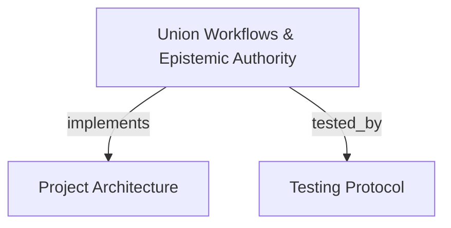

# Union Cognitive Workflows & Epistemic Authority
Coordinates session horizons, skill contract registries, effect-class gateways, thematic knowledge base bindings, caller-blind contestations, and founding proposals.

```graph
{
  "node_id": "feature:union-workflow",
  "domain": "union_workflow",
  "implements": ["adr:architecture"],
  "tested_by": ["adr:tests"],
  "entrypoints": [
    "src/mcp/union_handler.c"
  ],
  "registration_files": [
    "src/mcp/union_handler.h"
  ],
  "reference_files": [
    "src/union/union_session.c",
    "src/union/union_session.h"
  ],
  "code_files": [
    "src/union/union_anchor.c",
    "src/union/union_binding.c",
    "src/union/union_claim.c",
    "src/union/union_contest.c",
    "src/union/union_contract.c",
    "src/union/union_founding.c",
    "src/union/union_gateway.c",
    "src/union/union_grounding.c",
    "src/union/union_routing.c",
    "src/union/union_sweep.c",
    "src/union/union_theme_registry.c"
  ],
  "test_files": [
    "tests/test_union_contest.c",
    "tests/test_union_founding.c",
    "tests/test_union_gateway.c",
    "tests/test_union_routing.c",
    "tests/test_union_workflow_e2e.c"
  ]
}
```

## OVERVIEW
The Union subsystem implements the cognitive workflow and epistemic authority layer derived from `docs/PRD/novos-paradgimas` (PRD_V3, AUDIT-WORKFLOW Track W). It exposes 12 MCP tools governing intent classification, provenance validation, thematic knowledge base registry, normative and consulted bindings, session horizons, effect-class gateways, caller-blind contestation, and theme founding.

## FOLDER STRUCTURE
<folder_structure>
```
src/
├── union/                  # Core session horizons, effect gateways, craft themes, and sweep
└── mcp/                    # MCP JSON-RPC tool endpoints for union workflows
    ├── union_handler.c     # Handlers for sessions, gateway, themes, contest, and founding
    └── union_handler.h     # Handler function prototypes for Track W tools
```
</folder_structure>

## MAIN CONCEPTS

### The Workflow Lifecycle in Novos Paradigmas
The 12 tools follow the canonical station lifecycle specified in AUDIT-WORKFLOW §6:
1. **Routing Moment**: `classify_activity` routes incoming intent into `CONSULTATIVE` (project-internal) or `SPECIALTY` (requires craft tradition).
2. **Grounding in Tradition**: Query themes with `theme_lookup` (surfacing `ABSENT` as a valid state), register themes with `theme_register`, and check bindings with `binding_claim`.
3. **Session Horizon Deliberation**: `union_session_open` allocates a session bound to identity and contract. Every craft judgment must pass `validate_provenance` (canon citation or declared invention).
4. **Execution & Effect Gateway**: `union_record_action` authorizes actions through `CbmGateway` (`IDEMPOTENT`, `COMPENSABLE`, `IRREVERSIBLE`).
5. **Caller-Blind Contestation**: `contest_verify` allows review subagents to contest claims with concrete evidence without caller identity bias. Unresolved blocking contestations block promotion.
6. **Closure Sweep & Harvesting**: `union_session_close` finalizes the session and runs sweep checks. Inventions are proposed via `founding_propose` and decided by the operator via `founding_decide`.

## HOW TO EXECUTE UNION WORKFLOWS

### Prerequisites
1. Ensure the MCP server is initialized with union registries enabled.
2. Confirm the agent archetype identity and target project context.

### Execution Flow
1. Classify task intent using `classify_activity`.
2. Inspect or register craft themes using `theme_lookup` or `theme_register`.
3. Bind project architecture to craft standards using `binding_claim`.
4. Open an authenticated session horizon via `union_session_open`.
5. Authorize and record state actions via `union_record_action`.
6. Submit contestations via `contest_verify` when evidence disputes claims.
7. Close the session horizon with `union_session_close` and submit founding proposals via `founding_propose`.

<code_example>
# CORRECT: Opening session, authorizing action through gateway, and closing session
classify_activity(intent="Refactor payment gateway with DDD clean architecture")
union_session_open(identity="developer", contract_id="c_dev_standard", based_on_seq="gen_2026_09")
union_record_action(horizon_id="h_sess_01", action_name="update_handler", effect_class="COMPENSABLE", idempotency_key="key_123")
union_session_close(horizon_id="h_sess_01", reason="NORMAL")

# WRONG: Executing mutations without session horizon or effect gateway
execute_mutation(payload); // Bypasses contract boundaries, budget ledger, and closure sweep
</code_example>

## PARAMETERS / CONFIGURATIONS

| Tool | Parameters | Description | Default |
|---|---|---|---|
| `classify_activity` | `intent` | Classify user intent into `CONSULTATIVE` (project planes) or `SPECIALTY` (craft tradition required). | — |
| `validate_provenance` | `theme_id`, `node_uri`, `pinned_version`, `declared_invention`, `rationale` | Validate specialty judgment provenance. Refuses silent invention via `PROVENANCE_UNDECLARED`. | — |
| `theme_lookup` | `theme_id` | Query Thematic Knowledge Base in registry. Surfaces `ABSENT` as a first-class queryable state. | — |
| `theme_register` | `theme_id`, `namespace`, `curator`, `version`, `status` | Register or catalog a Thematic Knowledge Base. Status: `ACTIVE` or `ABSENT`. | `status="ACTIVE"` |
| `binding_claim` | `claim_id`, `theme_id`, `pinned_version`, `mode`, `binding_scope`, `validated_by` | Declare or query project binding to craft theme. Mode: `NORMATIVE` (`DEVE`) or `CONSULTED` (`PODE`). Operator required for `NORMATIVE`. | `mode="NORMATIVE"` |
| `union_session_open` | `identity`, `contract_id`, `based_on_seq`, `client_pid` | Open a bounded session horizon with contract validation and restricted-mode gating. | — |
| `union_session_get` | `horizon_id` | Query the live state of an open session horizon (action count, sequence number, budget). | — |
| `union_session_close` | `horizon_id`, `reason` | Close session horizon, emit typed closure event, and trigger closure sweep. Reasons: `NORMAL`, `ABNORMAL`, `EMPTY`. | `reason="NORMAL"` |
| `union_record_action` | `horizon_id`, `action_name`, `effect_class`, `auth_id`, `idempotency_key` | Authorize and record action through Effect-Class Gateway. Classes: `IDEMPOTENT`, `COMPENSABLE`, `IRREVERSIBLE`, `UNCLASSIFIED`. | `effect_class="IDEMPOTENT"` |
| `contest_verify` | `target_ref`, `severity`, `evidence` | Submit caller-blind contestation with mandatory evidence. Severities: `INFORMATIVE`, `BLOCKING`, `INVALIDATING`. | `severity="BLOCKING"` |
| `founding_propose` | `suggested_theme_id`, `namespace`, `rationale`, `origin_session`, `suggested_curator` | Propose new Thematic Knowledge Base from declared inventions harvested during closure sweep. | — |
| `founding_decide` | `suggested_theme_id`, `operator_accepted`, `is_agent_autonomous` | Operator decision to accept proposal into DRAFT theme or decline. Autonomous agent decisions are rejected. | `is_agent_autonomous=false` |

## BEST PRACTICES
REQUIRED: Classify intent via `classify_activity` at the start of any prompt to determine if specialty tradition is required.
REQUIRED: Declare provenance on all specialty judgments via `validate_provenance` (canon citation or declared invention).
REQUIRED: Validate all state-modifying actions through `union_record_action` before applying filesystem writes.
REQUIRED: Supply concrete evidence references when invoking `contest_verify`.
PROHIBITED: Accepting founding proposals autonomously (`is_agent_autonomous=true`); operator confirmation is mandatory.
PROHIBITED: Promoting cognitive horizons with unresolved blocking contestations.

## TIPS
When `theme_lookup` returns `ABSENT`, proceed under declared invention with explicit rationale, then harvest conventions via `founding_propose` at session closure.

<code_tip>
// Validating provenance for novel architectural patterns
validate_provenance(
    theme_id="@org/clean-arch",
    declared_invention=true,
    rationale="Implements custom actor mailbox pattern not covered by standard theme"
)
</code_tip>

## DOCUMENT MAP



## REFERENCES

- [**ARCHITECTURE.md**](../adr/ARCHITECTURE.md): Union subsystems, session registries, and effect gateways.
- [**TESTS.md**](../adr/TESTS.md): Test harness execution, union workflow tests, and E2E runner.
- [**multi_graph_federation.md**](./multi_graph_federation.md): Cognitive horizons and speculative overlays.
- [**code_discovery.md**](./code_discovery.md): Discovery tools for Realization Plane grounding.
