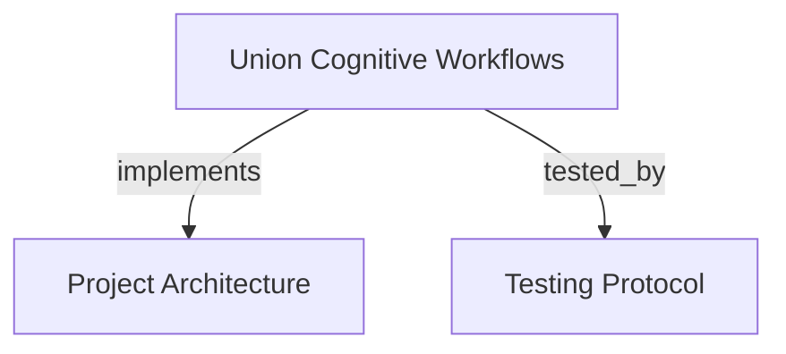

# Union Cognitive Workflows & Epistemic Authority
Coordinates session horizons, skill contract registries, effect-class gateways, and thematic knowledge base bindings for autonomous agent workflows.

```graph
{
  "node_id": "feature:union-workflow",
  "domain": "union_workflow",
  "implements": ["adr:architecture"],
  "tested_by": ["adr:tests"],
  "entrypoints": [
    "src/mcp/union_handler.c"
  ],
  "registration_files": [
    "src/mcp/union_handler.h",
    "src/mcp/mcp.c",
    "src/mcp/mcp_internal.h"
  ],
  "reference_files": [
    "src/union/union_session.c",
    "src/union/union_session.h"
  ],
  "code_files": [
    "src/union/union_anchor.c",
    "src/union/union_anchor.h",
    "src/union/union_binding.c",
    "src/union/union_binding.h",
    "src/union/union_claim.c",
    "src/union/union_claim.h",
    "src/union/union_contest.c",
    "src/union/union_contest.h",
    "src/union/union_contract.c",
    "src/union/union_contract.h",
    "src/union/union_cross_territory.c",
    "src/union/union_cross_territory.h",
    "src/union/union_doc_edges.c",
    "src/union/union_doc_edges.h",
    "src/union/union_doc_l0.c",
    "src/union/union_doc_l0.h",
    "src/union/union_drift.c",
    "src/union/union_drift.h",
    "src/union/union_ecg.c",
    "src/union/union_ecg.h",
    "src/union/union_founding.c",
    "src/union/union_founding.h",
    "src/union/union_gateway.c",
    "src/union/union_gateway.h",
    "src/union/union_grounding.c",
    "src/union/union_grounding.h",
    "src/union/union_ledger.c",
    "src/union/union_ledger.h",
    "src/union/union_promotion.c",
    "src/union/union_promotion.h",
    "src/union/union_refusal.c",
    "src/union/union_refusal.h",
    "src/union/union_routing.c",
    "src/union/union_routing.h",
    "src/union/union_sweep.c",
    "src/union/union_sweep.h",
    "src/union/union_theme_drift.c",
    "src/union/union_theme_drift.h",
    "src/union/union_theme_registry.c",
    "src/union/union_theme_registry.h",
    "src/union/union_trace.c",
    "src/union/union_trace.h"
  ],
  "test_files": [
    "tests/test_union_anchor.c",
    "tests/test_union_binding.c",
    "tests/test_union_claim.c",
    "tests/test_union_contest.c",
    "tests/test_union_contract.c",
    "tests/test_union_cross_territory.c",
    "tests/test_union_doc_edges.c",
    "tests/test_union_doc_l0.c",
    "tests/test_union_drift.c",
    "tests/test_union_ecg.c",
    "tests/test_union_founding.c",
    "tests/test_union_gateway.c",
    "tests/test_union_grounding.c",
    "tests/test_union_ledger.c",
    "tests/test_union_promotion.c",
    "tests/test_union_refusal.c",
    "tests/test_union_routing.c",
    "tests/test_union_session.c",
    "tests/test_union_sweep.c",
    "tests/test_union_theme_drift.c",
    "tests/test_union_theme_registry.c",
    "tests/test_union_trace.c",
    "tests/test_union_workflow_e2e.c"
  ]
}
```

## OVERVIEW
The Union subsystem implements epistemic authority and workflow federation across cognitive horizons. It governs agent session lifecycles, classifies effect activities through security gateways, tracks budget ledgers, enforces thematic knowledge base bindings, and validates claim distillation across the documentary substrate.

## FOLDER STRUCTURE
<folder_structure>
```
src/
├── union/                    # Core union contracts, session lifecycles, and claim registries
│   ├── union_session.*       # Session horizons, activity recording, and state lifecycle
│   ├── union_contract.*      # Skill contract registry and archetype verification
│   ├── union_gateway.*       # Effect-class admission gateway and refusal enforcement
│   ├── union_theme_*.*       # Thematic Knowledge Base registries and drift monitors
│   ├── union_claim.*         # Claim node distillation and epistemic status ([B], [E], [A])
│   ├── union_contest.*       # Caller-blind contestation registry and evidence checks
│   └── union_doc_*.*         # Structural extraction L0 and referential resolution L1
└── mcp/                      # JSON-RPC tool endpoints for union workflows
    └── union_handler.*       # MCP handlers for session, theme, contest, and founding tools
```
</folder_structure>

## MAIN CONCEPTS

### Session Horizons & Skill Contracts
- **Session Horizons**: Ephemeral transaction envelopes bound to client sessions, tracking action sequences and budget ledgers.
- **Skill Contracts**: Declarative contracts (`CbmContractRegistry`) defining permitted effect classes, required inputs, and verification obligations.
- **Restricted Mode**: Unregistered identities operate under restricted fallback constraints, rejecting unpermitted mutation activities.

### Effect-Class Gateway & Refusals
- **Effect Hierarchy**: Operations classify into `READ_ONLY`, `LOCAL_STATE`, `EPHEMERAL_MUTATION`, `COMMITTED_MUTATION`, and `SYSTEMIC_CHANGE`.
- **Typed Refusals**: Requests violating contracts trigger deterministic refusal payloads (`REFUSAL_UNGROUNDED`, `REFUSAL_OUT_OF_SCOPE`, `REFUSAL_BUDGET_EXHAUSTED`, `REFUSAL_CONFLICT`).

### Thematic Knowledge Bases & Contestation
- **Craft Themes**: Centralized thematic repositories (`@org/namespace`) providing normative (`DEVE`) or consulted (`PODE`) conventions.
- **Caller-Blind Contestation**: Verification evaluates evidence solely against repository reality, never on caller authority. Active blocking contestations prevent horizon promotion.
- **Founding Proposals**: Inventions harvested during closure sweeps can be proposed for new themes; operator acceptance is required for graduation.

## HOW TO EXECUTE UNION WORKFLOWS

### Prerequisites
1. Initialize the MCP server with union registries enabled.
2. Register active skill contracts or operate with an authenticated session token.

### Execution Flow
1. Open a union session via `union_session_open`.
2. Execute reads and mutations while recording actions through `union_record_action`.
3. Validate action classes against the gateway before committing changes.
4. Verify contestations before invoking `promote_horizon`.
5. Finalize session closure with `union_session_close`.

<code_example>
# CORRECT: Verifying effect class before executing mutation
int effect = cbm_gateway_classify(action_name);
if (cbm_gateway_allows(&session->contract, effect)) {
    cbm_session_record_action(&session, action_name, payload);
    execute_action(payload);
} else {
    return cbm_refusal_create(REFUSAL_OUT_OF_SCOPE, "Effect exceeds contract");
}

# WRONG: Executing mutations without gateway authorization
execute_action(payload); // Bypasses contract gate, leading to unverified mutations
</code_example>

## PARAMETERS / CONFIGURATIONS

| Tool | Parameters | Description |
|---|---|---|
| `union_session_open` | `identity`, `contract_id` | Initializes a session horizon; returns `horizon_id` and restricted flag. |
| `union_session_get` | `horizon_id` | Retrieves current session state, sequence number, and budget consumption. |
| `union_session_close` | `horizon_id`, `reason` | Concludes a session and triggers closure sweep validation. |
| `union_record_action` | `horizon_id`, `action`, `target` | Records an atomic step into the factual session trace. |
| `classify_activity` | `action_name` | Queries the effect-class category for an intended operation. |
| `theme_register` | `theme_id`, `namespace`, `curator` | Enrolls a new thematic knowledge base into the registry. |
| `binding_claim` | `claim_id`, `theme_id`, `mode` | Binds project architecture to a normative or consulted theme. |
| `founding_propose` | `suggested_theme_id`, `rationale` | Proposes a new thematic knowledge base from harvested innovations. |
| `founding_decide` | `suggested_theme_id`, `operator_accepted` | Operator-gated decision to admit a proposed theme into draft status. |
| `contest_verify` | `target_ref`, `severity`, `evidence` | Submits a typed contestation with concrete host evidence. |

## BEST PRACTICES
REQUIRED: Validate all mutating actions through `CbmGateway` prior to execution.
REQUIRED: Supply concrete evidence paths for every `contest_verify` invocation.
REQUIRED: Require explicit human operator confirmation on `founding_decide`; autonomous agent creation of themes is forbidden.
FORBIDDEN: Promoting an ephemeral horizon with unhandled blocking or invalidating contestations.
FORBIDDEN: Recording synthetic or unverified actions in factual session traces.

## TIPS
Cache theme lookups across stable session horizons to prevent redundant SQLite queries during multi-step agent traversals.

<code_tip>
// Optimized session verification check
if (session->is_restricted && effect >= EFFECT_COMMITTED_MUTATION) {
    return cbm_refusal_fast_reject(session->horizon_id, REFUSAL_OUT_OF_SCOPE);
}
</code_tip>

## DOCUMENT MAP



## REFERENCES

- [**ARCHITECTURE.md**](../adr/ARCHITECTURE.md): Architectural patterns, layers, and union subsystems.
- [**TESTS.md**](../adr/TESTS.md): Test harness execution, union workflow tests, and coverage criteria.
- [**multi_graph_federation.md**](./multi_graph_federation.md): Cognitive horizons and multi-graph base storage.
