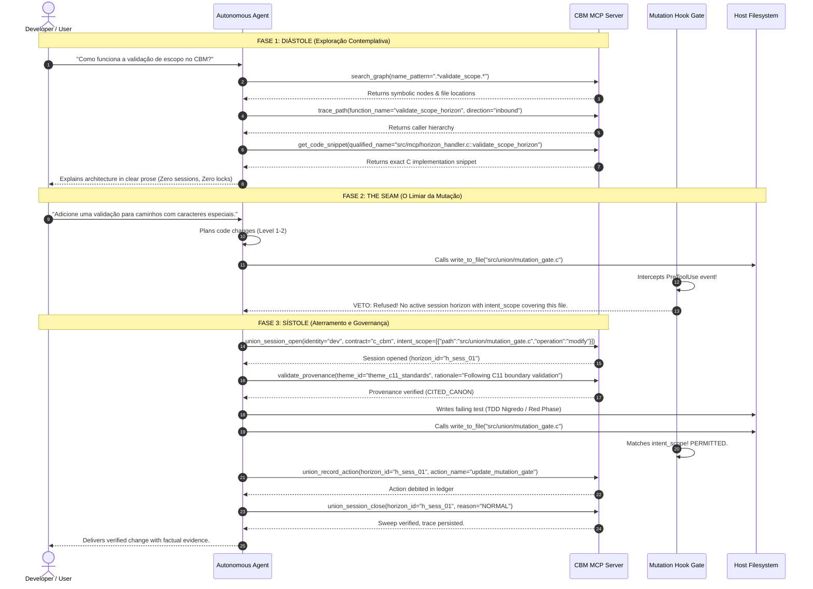

# Consumption & Integration Guide — Codebase Memory MCP

This guide details how human engineers and autonomous AI agents configure, initialize, and consume `codebase-memory-mcp` across supported platforms and IDEs.

---

## 1. System Requirements & Binary Architecture

`codebase-memory-mcp` is compiled as a single native C11 executable with embedded SQLite and Tree-sitter parsers. It requires **no external daemon, no Docker, and no runtime interpreter (Node/Python)** to run the core MCP server.

| Platform | Binary Name | Build Requirements | Notes |
| :--- | :--- | :--- | :--- |
| **Windows Native** | `cbm.exe` | MSYS2 / MinGW-w64 (GCC 11+ or Clang 13+) | Native Win32 file locking, memory-mapped I/O, path normalization. |
| **Linux / POSIX** | `cbm` | GCC 9+ / Clang 10+, `make`, `libzstd` | Native POSIX threads, SQLite WAL mode, UNIX domain sockets. |
| **macOS (Darwin)** | `cbm` | Apple Clang (Xcode CLI Tools) | Universal binary (ARM64 / x86_64). |
| **WSL2 / DrvFs** | `cbm` | Linux toolchain | Cross-filesystem boundary support, `ETXTBSY` avoidance. |

---

## 2. Client Configuration

### 2.1 Google Antigravity & AI Studio

In Antigravity, CBM is registered as an MCP server in the client configuration, and optionally protected by the **Cognitive Respiration Mutation Gate** (`hooks.json`).

#### MCP Server Registration (`~/.gemini/antigravity/mcp_servers.json` or project settings):
```json
{
  "mcpServers": {
    "codebase-memory-mcp": {
      "command": "c:/Users/corre/Documents/codebase-memory-mcp/build/cbm.exe",
      "args": ["serve", "--storage-dir", "c:/Users/corre/Documents/codebase-memory-mcp/.codebase-memory"],
      "env": {
        "CBM_LOG_LEVEL": "info",
        "CBM_MAX_FDS": "16"
      }
    }
  }
}
```

#### Mutation Gate Hook (`.agents/hooks.json` or `~/.gemini/antigravity/hooks.json`):
```json
{
  "hooks": {
    "PreToolUse": [
      {
        "matcher": "write_to_file|replace_file_content",
        "command": "c:/Users/corre/Documents/codebase-memory-mcp/build/cbm.exe",
        "args": ["hook-eval", "--host", "antigravity", "--stdin"]
      }
    ]
  }
}
```

---

### 2.2 Claude Desktop

Add CBM to your `claude_desktop_config.json`:
- **macOS**: `~/Library/Application Support/Claude/claude_desktop_config.json`
- **Windows**: `%APPDATA%\Claude\claude_desktop_config.json`

```json
{
  "mcpServers": {
    "codebase-memory": {
      "command": "C:\\Users\\corre\\Documents\\codebase-memory-mcp\\build\\cbm.exe",
      "args": ["serve", "--storage-dir", "C:\\Users\\corre\\.codebase-memory"],
      "env": {
        "CBM_LOG_LEVEL": "info"
      }
    }
  }
}
```

---

### 2.3 Cursor IDE

In Cursor, navigate to **Settings > Features > MCP** and add a new MCP server:

- **Name**: `codebase-memory`
- **Type**: `command`
- **Command**: `C:\Users\corre\Documents\codebase-memory-mcp\build\cbm.exe serve --storage-dir C:\Users\corre\.codebase-memory`

Alternatively, add it to `.cursor/mcp.json` in your workspace:
```json
{
  "mcpServers": {
    "codebase-memory": {
      "command": "cbm",
      "args": ["serve"]
    }
  }
}
```

---

### 2.4 OpenAI Codex CLI

In Codex, register CBM in `~/.codex/config.toml`:

```toml
[mcp_servers.codebase_memory]
command = "cbm"
args = ["serve"]

[hooks]
pre_tool_use = "cbm hook-eval --host codex --stdin"
```

---

## 3. CLI Direct Consumption

The CBM binary can be used directly from the command line for indexing, queries, and maintenance without launching an MCP client.

```bash
# 1. Index the current repository
cbm index . --mode full

# 2. Check indexing status and coverage
cbm status --project codebase-memory-mcp

# 3. Search symbols by regex pattern
cbm search ".*mutation_gate.*" --format tree

# 4. Trace inbound callers of a function
cbm trace "cbm_mutation_gate_evaluate" --direction inbound --depth 3

# 5. Run a Cypher query
cbm query "MATCH (f:Function) WHERE f.degree > 10 RETURN f.name, f.degree LIMIT 10"

# 6. Audit active ephemeral horizons
cbm horizon list
```

---

## 4. Agent Consumption Rules & Evidence Tiers

When an LLM agent consumes CBM, it must follow the **Axiom of Containment and Testimony** (PRD_V3, ADR_V1). The agent must never rely on self-report or assumption.

### Evidence Tiers

```text
┌─────────────────────────────────────────────────────────────┐
│  Tier 1: SCOUT (Provisional Lookup)                         │
│  - Quick positive checks using search_graph or search_code. │
│  - PROHIBITED: Negative claims ("X does not exist").        │
├─────────────────────────────────────────────────────────────┤
│  Tier 2: VERIFY (Default Task Grounding)                    │
│  - Directed trace_path (inbound & outbound).                │
│  - Exact get_code_snippet inspection.                       │
│  - Single call to check_index_coverage on evidence paths.   │
├─────────────────────────────────────────────────────────────┤
│  Tier 3: AUDITOR (Exhaustive & Refusal-Grade)               │
│  - Bounded-scope complete verification.                     │
│  - Complete pagination over query_graph and trace_path.     │
│  - Both call directions examined.                           │
│  - check_index_coverage called on all candidate scopes.     │
│  - Every limitation and unindexed gap explicitly disclosed. │
└─────────────────────────────────────────────────────────────┘
```

---

## 5. The Cognitive Respiration Cycle (Practical Agent Loop)



---

## 6. Troubleshooting Common Issues

### 6.1 `PROVENANCE_UNDECLARED` Refusal
- **Symptom**: Calling `union_record_action` or modifying code results in error `PROVENANCE_UNDECLARED`.
- **Cause**: The agent attempted a specialty code modification without either citing a registered theme or confessing declared invention.
- **Fix**: Call `validate_provenance` before acting:
  - If following team standards: pass `theme_id`, `node_uri`, `pinned_version`.
  - If improvising or creating a novel solution: pass `declared_invention=true` with a clear `rationale`.

### 6.2 `MUTATION_OUT_OF_SCOPE` Hook Refusal
- **Symptom**: The host hook blocks `write_to_file` or `replace_file_content` with a veto message.
- **Cause**: The target file path is not present in the active session's `intent_scope` whitelist, or no session is currently open.
- **Fix**: Call `union_session_open` providing an exact absolute path and operation pair in `intent_scope`. Remember that `intent_scope` is strictly limited to **1 to 4 files**.

### 6.3 SQLite Handle Exhaustion (`EMFILE` / Error 24)
- **Symptom**: `Failed to allocate horizon database handle: too many open files`.
- **Cause**: Unmanaged SQLite connections or lingering stale horizons.
- **Fix**: CBM enforces an LRU connection pool capped at 16 file descriptors (`HorizonConnectionPool`). The background `horizon_reaper` automatically closes and unlinks abandoned horizons older than TTL (default: 3600s). Ensure tests use `cbm_horizon_pool_get` and `cbm_horizon_pool_release`.
