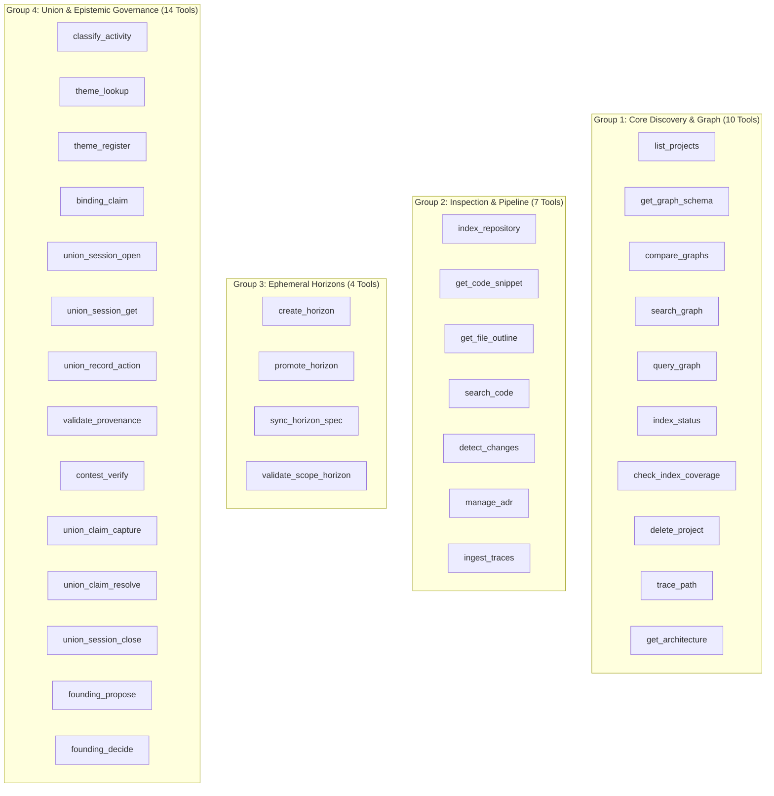

# MCP Tools Reference — Codebase Memory (35 Tools)

This document provides the exhaustive technical reference for all **35 MCP tools** implemented in the `codebase-memory-mcp` C11 runtime (`src/mcp/mcp.c`, `src/mcp/handlers.c`, `src/mcp/union_handler.c`, `src/mcp/horizon_handler.c`, and `src/mcp/index_supervisor.c`).

---

## Architecture Overview of Tool Groups



---

# Group 1: Núcleo de Descoberta & Grafo (10 Tools)

These tools provide read-only queries and traversals over the Realization Plane ("What is"). They operate passively during **Diástole** without requiring sessions, locks, or ledger debits.

---

### 1. `list_projects`
- **Purpose**: Lists all indexed projects in the local SQLite multi-graph store with paths, branch names, and optional metrics.
- **Parameters**:
  | Parameter | Type | Required | Default | Description |
  | :--- | :--- | :--- | :--- | :--- |
  | `detail` | string | No | `"identity"` | Level of detail: `"identity"` (name and path) or `"stats"` (nodes, edges, disk size). |
  | `include_details` | boolean | No | `false` | Compatibility flag for backward compatibility. |
  | `limit` | integer | No | `50` | Maximum projects returned. |
  | `offset` | integer | No | `0` | Pagination offset. |
  | `format` | string | No | `"tree"` | Output format (`"tree"`, `"json"`, or `"compact"`). |

- **Invocation Example**:
```json
{
  "name": "list_projects",
  "arguments": {
    "detail": "stats",
    "limit": 10
  }
}
```

- **Response Example**:
```json
{
  "projects": [
    {
      "name": "codebase-memory-mcp",
      "root_path": "c:/Users/corre/Documents/codebase-memory-mcp",
      "branch": "main",
      "commit": "40a26fd16880e5f9e989edbf7cf21500723ace2e",
      "node_count": 14205,
      "edge_count": 48312,
      "db_size_bytes": 15728640,
      "last_indexed": "2026-09-30T18:45:00Z"
    }
  ],
  "total": 1
}
```

---

### 2. `get_graph_schema`
- **Purpose**: Returns the schema definition of the graph database, detailing all node labels, relationship/edge types, and property names.
- **Parameters**:
  | Parameter | Type | Required | Default | Description |
  | :--- | :--- | :--- | :--- | :--- |
  | `project` | string | No | `null` | Target project. If omitted, uses default active project. |
  | `diagnostics` | string | No | `"none"` | Level of schema diagnostics (`"none"`, `"summary"`, `"full"`). |
  | `limit` | integer | No | `50` | Maximum items per category. |
  | `offset` | integer | No | `0` | Schema item pagination offset. |
  | `format` | string | No | `"tree"` | Output format (`"tree"` or `"json"`). |

- **Invocation Example**:
```json
{
  "name": "get_graph_schema",
  "arguments": {
    "project": "codebase-memory-mcp",
    "diagnostics": "summary"
  }
}
```

- **Response Example**:
```json
{
  "labels": ["Function", "Class", "Interface", "Module", "Variable", "Route", "Type"],
  "edge_types": ["CALLS", "IMPORTS", "EXTENDS", "IMPLEMENTS", "CONTAINS", "DEPENDS_ON"],
  "property_keys": ["name", "qualified_name", "file_path", "line", "byte_offset", "visibility", "docstring", "hash"]
}
```

---

### 3. `compare_graphs`
- **Purpose**: Deterministically compares two indexed snapshots or an active ephemeral horizon against the base graph, highlighting added, modified, and removed nodes and edges.
- **Parameters**:
  | Parameter | Type | Required | Default | Description |
  | :--- | :--- | :--- | :--- | :--- |
  | `base_project` | string | Yes | — | Base graph project or baseline generation snapshot. |
  | `target_project` | string | Yes | — | Target project or horizon ID to compare against base. |
  | `limit` | integer | No | `200` | Max diff records returned. |
  | `scan_limit` | integer | No | `2000000` | Max rows scanned in SQLite. |

- **Invocation Example**:
```json
{
  "name": "compare_graphs",
  "arguments": {
    "base_project": "codebase-memory-mcp",
    "target_project": "horizon_spec_refactor",
    "limit": 50
  }
}
```

- **Response Example**:
```json
{
  "diff_summary": {
    "nodes_added": 3,
    "nodes_removed": 0,
    "edges_added": 7,
    "edges_removed": 2
  },
  "added_nodes": [
    {"cbm_uri": "cbm://core/payment.c#validate_currency", "label": "Function"}
  ],
  "added_edges": [
    {"source": "cbm://core/payment.c#process", "target": "cbm://core/payment.c#validate_currency", "type": "CALLS"}
  ]
}
```

---

### 4. `search_graph`
- **Purpose**: Primary symbol discovery tool. Finds functions, types, routes, classes, and variables via regex, BM25 text match, or degree filters, with support for active horizon overlays.
- **Parameters**:
  | Parameter | Type | Required | Default | Description |
  | :--- | :--- | :--- | :--- | :--- |
  | `project` | string | No | `null` | Project name. |
  | `query` | string | No | `null` | BM25 free text search query. |
  | `name_pattern` | string | No | `null` | Regex matching symbol simple name (e.g. `".*Payment.*"`). |
  | `qn_pattern` | string | No | `null` | Regex matching fully qualified name. |
  | `file_pattern` | string | No | `null` | Regex matching source file path. |
  | `relationship` | string | No | `null` | Edge type filter (e.g. `"CALLS"`). |
  | `min_degree` | integer | No | `0` | Minimum graph connectivity degree. |
  | `max_degree` | integer | No | `10000` | Maximum graph connectivity degree. |
  | `active_horizons` | array | No | `[]` | List of ephemeral horizon IDs to overlay. |
  | `limit` | integer | No | `50` | Maximum results returned. |
  | `format` | string | No | `"tree"` | Output serialization (`"tree"`, `"json"`, `"compact"`). |
  | `max_output_tokens`| integer | No | `3200` | Hard token budget limit for serialization. |

- **Invocation Example**:
```json
{
  "name": "search_graph",
  "arguments": {
    "project": "codebase-memory-mcp",
    "name_pattern": ".*mutation_gate.*",
    "format": "tree"
  }
}
```

- **Response Example**:
```text
[Function] cbm_mutation_gate_evaluate
  file: src/union/mutation_gate.c:142
  qn: union::mutation_gate::cbm_mutation_gate_evaluate
  degree: 8 (in: 3, out: 5)
[Function] cbm_mutation_gate_init
  file: src/union/mutation_gate.c:35
  qn: union::mutation_gate::cbm_mutation_gate_init
  degree: 2 (in: 2, out: 0)
```

---

### 5. `query_graph`
- **Purpose**: Executes declarative Cypher queries over the codebase graph (or missed coverage file tree), returning tabular or tree projections.
- **Parameters**:
  | Parameter | Type | Required | Default | Description |
  | :--- | :--- | :--- | :--- | :--- |
  | `query` | string | Yes | — | Cypher query string (e.g. `"MATCH (f:Function)-[:CALLS]->(t:Function) RETURN f.name, t.name"`). |
  | `project` | string | No | `null` | Target project. |
  | `graph` | string | No | `"code"` | Graph target: `"code"` (symbolic code graph) or `"missed"` (unindexed/partial files). |
  | `active_horizons` | array | No | `[]` | Ephemeral horizons to merge. |
  | `max_rows` | integer | No | `200` | Maximum rows returned. |
  | `cursor` | string | No | `null` | Pagination cursor. |
  | `format` | string | No | `"tree"` | Output format (`"tree"` or `"json"`). |

- **Invocation Example**:
```json
{
  "name": "query_graph",
  "arguments": {
    "project": "codebase-memory-mcp",
    "query": "MATCH (h:Function) WHERE h.name STARTS WITH 'cbm_admission' RETURN h.name, h.file_path",
    "max_rows": 10
  }
}
```

- **Response Example**:
```json
{
  "columns": ["h.name", "h.file_path"],
  "rows": [
    ["cbm_admission_gate_create", "src/admission/admission_gate.c"],
    ["cbm_admission_gate_admit", "src/admission/admission_gate.c"],
    ["cbm_admission_gate_verify_anchors", "src/admission/anchor_checker.c"]
  ],
  "row_count": 3,
  "has_more": false
}
```

---

### 6. `index_status`
- **Purpose**: Returns health, integrity, and progress metrics for the project index, including AST parse gaps and generation identifiers.
- **Parameters**:
  | Parameter | Type | Required | Default | Description |
  | :--- | :--- | :--- | :--- | :--- |
  | `project` | string | No | `null` | Project name. |
  | `diagnostics` | string | No | `"none"` | Level of diagnostics: `"none"`, `"summary"`, `"full"`. |
  | `verbose` | boolean | No | `false` | Include verbose unindexed file paths. |
  | `format` | string | No | `"tree"` | Output format (`"tree"` or `"json"`). |

- **Invocation Example**:
```json
{
  "name": "index_status",
  "arguments": {
    "project": "codebase-memory-mcp",
    "diagnostics": "summary"
  }
}
```

- **Response Example**:
```json
{
  "project": "codebase-memory-mcp",
  "status": "READY",
  "generation_id": "2026-09-30T18:45:00Z",
  "git_commit": "40a26fd16880e5f9e989edbf7cf21500723ace2e",
  "nodes": 14205,
  "edges": 48312,
  "indexed_files": 128,
  "unindexed_files": 0,
  "parse_errors": 0,
  "coverage_percentage": 100.0
}
```

---

### 7. `check_index_coverage`
- **Purpose**: Epistemic validation tool. Verifies whether candidate paths and line ranges are fully indexed, stale, partial, or excluded before making negative or exhaustive claims.
- **Parameters**:
  | Parameter | Type | Required | Default | Description |
  | :--- | :--- | :--- | :--- | :--- |
  | `project` | string | No | `null` | Project name. |
  | `paths` | array | Yes | — | Exact relative or absolute file paths to check. |
  | `scopes` | array | No | `[]` | Directory scopes to check for completeness. |
  | `path_limit` | integer | No | `20` | Max paths processed per call. |
  | `scope_limit`| integer | No | `5` | Max scopes processed. |
  | `diagnostics`| string | No | `"none"` | Level of detail (`"none"`, `"summary"`, `"full"`). |
  | `format` | string | No | `"tree"` | Output format (`"tree"` or `"json"`). |

- **Invocation Example**:
```json
{
  "name": "check_index_coverage",
  "arguments": {
    "project": "codebase-memory-mcp",
    "paths": ["src/mcp/union_handler.c", "src/union/mutation_gate.c"]
  }
}
```

- **Response Example**:
```json
{
  "coverage_status": "CLEAN",
  "paths": [
    {"path": "src/mcp/union_handler.c", "status": "INDEXED", "missed_ranges": []},
    {"path": "src/union/mutation_gate.c", "status": "INDEXED", "missed_ranges": []}
  ],
  "has_gaps": false
}
```

---

### 8. `delete_project`
- **Purpose**: Completely deletes a project's persisted graph database, index artifacts, and associated SQLite WAL files from disk.
- **Parameters**:
  | Parameter | Type | Required | Default | Description |
  | :--- | :--- | :--- | :--- | :--- |
  | `project` | string | Yes | — | Project identifier to permanently remove. |

- **Invocation Example**:
```json
{
  "name": "delete_project",
  "arguments": {
    "project": "temporary-prototype-repo"
  }
}
```

- **Response Example**:
```json
{
  "status": "DELETED",
  "project": "temporary-prototype-repo",
  "freed_bytes": 8388608
}
```

---

### 9. `trace_path`
- **Purpose**: Traces call graphs, data-flow paths, and service boundaries (`inbound`, `outbound`, or `both`) across the base graph and active horizons.
- **Parameters**:
  | Parameter | Type | Required | Default | Description |
  | :--- | :--- | :--- | :--- | :--- |
  | `function_name` | string | Yes | — | Target function or symbol name. |
  | `direction` | string | No | `"both"` | Traversal direction: `"inbound"`, `"outbound"`, `"both"`. |
  | `depth` | integer | No | `3` | Maximum traversal hop depth (1–10). |
  | `mode` | string | No | `"calls"` | Tracing mode: `"calls"`, `"data_flow"`, `"cross_service"`. |
  | `project` | string | No | `null` | Project name. |
  | `parameter_name`| string | No | `null` | Parameter name when tracing data flow. |
  | `edge_types` | array | No | `[]` | Restrict to specific edge labels. |
  | `active_horizons`| array| No | `[]` | Active horizon IDs to overlay. |
  | `limit` | integer | No | `100` | Max paths returned. |

- **Invocation Example**:
```json
{
  "name": "trace_path",
  "arguments": {
    "project": "codebase-memory-mcp",
    "function_name": "cbm_mutation_gate_evaluate",
    "direction": "inbound",
    "depth": 2
  }
}
```

- **Response Example**:
```text
cbm_mutation_gate_evaluate (src/union/mutation_gate.c:142)
  ▲ CALLS (inbound)
  ├── handle_hook_eval (src/cli/hook_augment.c:89)
  │     ▲ CALLS (inbound)
  │     └── main (src/main.c:215)
  └── cbm_mcp_handle_record_action (src/mcp/union_handler.c:304)
```

---

### 10. `get_architecture`
- **Purpose**: Extracts structural topological summaries, circular dependency cycles, architectural layers, API routes, or hot spots.
- **Parameters**:
  | Parameter | Type | Required | Default | Description |
  | :--- | :--- | :--- | :--- | :--- |
  | `project` | string | No | `null` | Project identifier. |
  | `path` | string | No | `null` | Subtree path to scope the summary. |
  | `aspects` | array | No | `["overview"]`| Aspects to analyze: `"overview"`, `"cycles"`, `"hotspots"`, `"layers"`, `"routes"`, `"clusters"`. |
  | `format` | string | No | `"tree"` | Output serialization (`"tree"` or `"json"`). |

- **Invocation Example**:
```json
{
  "name": "get_architecture",
  "arguments": {
    "project": "codebase-memory-mcp",
    "aspects": ["cycles", "hotspots"]
  }
}
```

- **Response Example**:
```json
{
  "project": "codebase-memory-mcp",
  "cycles_detected": 0,
  "hotspots": [
    {"symbol": "src/mcp/mcp.c#cbm_mcp_dispatch", "inbound_degree": 42, "risk": "CRITICAL_DISPATCHER"},
    {"symbol": "src/core/horizon_pool.c#cbm_horizon_pool_get", "inbound_degree": 28, "risk": "RESOURCE_HUB"}
  ],
  "layers": ["transport (src/mcp)", "governance (src/union)", "admission (src/admission)", "core (src/core)"]
}
```

---

# Group 2: Inspeção de Código, Diff & Pipeline (7 Tools)

These tools interact with raw source code, concrete syntax trees (Tree-sitter), git revision deltas, and ADR documentation.

---

### 11. `index_repository`
- **Purpose**: Triggers AST indexing of a target repository on disk, extracting symbols, relationships, and metadata into SQLite.
- **Parameters**:
  | Parameter | Type | Required | Default | Description |
  | :--- | :--- | :--- | :--- | :--- |
  | `repo_path` | string | Yes | — | Absolute filesystem path of repository. |
  | `name` | string | No | `null` | Custom project alias/name. |
  | `mode` | string | No | `"full"` | Indexing mode: `"full"`, `"moderate"`, `"fast"`, `"cross-repo-intelligence"`. |
  | `target_projects`| array | No | `[]` | Secondary projects to link for cross-repo intelligence. |
  | `persistence` | boolean| No | `false`| Persist across system restarts. |

- **Invocation Example**:
```json
{
  "name": "index_repository",
  "arguments": {
    "repo_path": "c:/Users/corre/Documents/codebase-memory-mcp",
    "mode": "full"
  }
}
```

- **Response Example**:
```json
{
  "status": "INDEXING_COMPLETED",
  "project": "codebase-memory-mcp",
  "files_scanned": 128,
  "symbols_indexed": 4820,
  "relationships_found": 18400,
  "duration_ms": 1240
}
```

---

### 12. `get_code_snippet`
- **Purpose**: Retrieves the exact, bounded source code snippet of a qualified symbol. Large classes/containers (>200 lines) are automatically outlined in `"auto"` mode.
- **Parameters**:
  | Parameter | Type | Required | Default | Description |
  | :--- | :--- | :--- | :--- | :--- |
  | `qualified_name`| string | Yes | — | Fully qualified symbol name (e.g. `"union::mutation_gate::cbm_mutation_gate_evaluate"`). |
  | `project` | string | No | `null` | Target project. |
  | `source_mode` | string | No | `"auto"` | Extraction mode: `"auto"`, `"full"`, `"declaration"`. |
  | `start_line` | integer| No | `0` | Optional slice starting line. |
  | `max_lines` | integer| No | `100` | Max lines to extract. |
  | `include_neighbors`| boolean| No| `false`| Include adjacent lines. |
  | `member_limit` | integer| No | `50` | Member outline limit in auto mode. |
  | `format` | string | No | `"tree"` | Output serialization (`"tree"` or `"json"`). |

- **Invocation Example**:
```json
{
  "name": "get_code_snippet",
  "arguments": {
    "project": "codebase-memory-mcp",
    "qualified_name": "src/union/mutation_gate.c::cbm_mutation_gate_evaluate",
    "source_mode": "full"
  }
}
```

- **Response Example**:
```c
// File: src/union/mutation_gate.c, Lines: 142-168
cbm_gate_verdict_t cbm_mutation_gate_evaluate(
    const cbm_session_t *session,
    const char *tool_name,
    const char *target_path,
    cbm_file_op_t op
) {
    if (!session || !session->is_active) {
        return CBM_GATE_DENIED_NO_ACTIVE_SESSION;
    }
    if (!cbm_path_matches_intent_scope(session->intent_scope, target_path, op)) {
        return CBM_GATE_DENIED_OUT_OF_SCOPE;
    }
    return CBM_GATE_PERMITTED;
}
```

---

### 13. `get_file_outline`
- **Purpose**: Generates the structural Tree-sitter AST declaration outline for a specific file (functions, structs, methods) without reading raw text.
- **Parameters**:
  | Parameter | Type | Required | Default | Description |
  | :--- | :--- | :--- | :--- | :--- |
  | `file_path` | string | Yes | — | Path of the file relative to repo root. |
  | `project` | string | No | `null` | Target project. |
  | `labels` | array | No | `[]` | Filter by node labels (e.g. `["Function", "Struct"]`). |
  | `limit` | integer | No | `100` | Max symbols returned. |
  | `offset` | integer | No | `0` | Pagination offset. |
  | `format` | string | No | `"tree"` | Output format (`"tree"` or `"json"`). |

- **Invocation Example**:
```json
{
  "name": "get_file_outline",
  "arguments": {
    "project": "codebase-memory-mcp",
    "file_path": "src/union/mutation_gate.h"
  }
}
```

- **Response Example**:
```text
Outline: src/union/mutation_gate.h
├── [Enum] cbm_gate_verdict_t (lines 14-22)
├── [Enum] cbm_file_op_t (lines 24-30)
├── [Struct] cbm_intent_scope_entry_t (lines 32-38)
└── [Function Declaration] cbm_mutation_gate_evaluate (line 45)
```

---

### 14. `search_code`
- **Purpose**: Fallback text and regex search over unindexed strings, error messages, and raw configuration files, with graph ranking.
- **Parameters**:
  | Parameter | Type | Required | Default | Description |
  | :--- | :--- | :--- | :--- | :--- |
  | `pattern` | string | Yes | — | Text or regex string to locate. |
  | `project` | string | No | `null` | Target project. |
  | `file_pattern` | string | No | `null` | Glob/regex file filter (e.g. `"*.json"`). |
  | `path_filter` | string | No | `null` | Directory path prefix. |
  | `mode` | string | No | `"compact"` | Output mode: `"compact"` (snippets), `"files"` (paths only), `"full"` (context). |
  | `regex` | boolean | No | `false` | Interpret pattern as regular expression. |
  | `limit` | integer | No | `10` | Max matches returned. |
  | `format` | string | No | `"tree"` | Output format. |

- **Invocation Example**:
```json
{
  "name": "search_code",
  "arguments": {
    "project": "codebase-memory-mcp",
    "pattern": "PROVENANCE_UNDECLARED",
    "file_pattern": "*.h"
  }
}
```

- **Response Example**:
```text
src/union/union_types.h:84
  #define CBM_REFUSAL_PROVENANCE_UNDECLARED "PROVENANCE_UNDECLARED"
```

---

### 15. `detect_changes`
- **Purpose**: Compares current git working tree or commit branch against a base branch (e.g. `main`), mapping diffs to impacted graph nodes and callers.
- **Parameters**:
  | Parameter | Type | Required | Default | Description |
  | :--- | :--- | :--- | :--- | :--- |
  | `project` | string | No | `null` | Target project. |
  | `base_branch` | string | No | `"main"` | Baseline git branch. |
  | `scope` | string | No | `"impact"` | Analysis scope: `"impact"` (blast radius), `"files"` (changed files), `"symbols"` (changed symbols). |
  | `direction` | string | No | `"inbound"` | Impact direction: `"inbound"` (who calls modified code), `"outbound"`, `"both"`. |
  | `depth` | integer | No | `2` | Traversal depth. |
  | `since` | string | No | `null` | Commit hash or ISO timestamp. |
  | `limit` | integer | No | `50` | Max results. |

- **Invocation Example**:
```json
{
  "name": "detect_changes",
  "arguments": {
    "project": "codebase-memory-mcp",
    "base_branch": "main",
    "scope": "impact",
    "direction": "inbound"
  }
}
```

- **Response Example**:
```json
{
  "modified_files": ["src/union/mutation_gate.c"],
  "modified_symbols": ["cbm_mutation_gate_evaluate"],
  "impacted_callers": [
    {"caller": "src/cli/hook_augment.c::handle_hook_eval", "hop_distance": 1},
    {"caller": "src/mcp/union_handler.c::handle_union_record_action", "hop_distance": 1}
  ]
}
```

---

### 16. `manage_adr`
- **Purpose**: Outlines, reads, validates, or updates Architecture Decision Records (ADRs) stored in the documentation plane (`docs/adr/`).
- **Parameters**:
  | Parameter | Type | Required | Default | Description |
  | :--- | :--- | :--- | :--- | :--- |
  | `mode` | string | No | `"outline"` | Operation mode: `"outline"`, `"read"`, `"update_section"`, `"create"`. |
  | `project` | string | No | `null` | Target project. |
  | `content` | string | No | `null` | Full content when creating or rewriting ADR. |
  | `section_updates`| object | No | `{}` | Key-value mapping of section names to replacement Markdown. |
  | `section_limit` | integer| No | `10` | Max sections returned in outline. |
  | `format` | string | No | `"tree"` | Output format. |

- **Invocation Example**:
```json
{
  "name": "manage_adr",
  "arguments": {
    "project": "codebase-memory-mcp",
    "mode": "outline"
  }
}
```

- **Response Example**:
```text
ADR Registry:
├── docs/adr/ARCHITECTURE.md [Node: adr:architecture]
│   └── Sections: OVERVIEW, FOLDER STRUCTURE, LAYERS, MODULES, PATTERNS, INTEGRATIONS
├── docs/adr/TESTS.md [Node: adr:tests]
│   └── Sections: OVERVIEW, COMMANDS, MINIMUM COVERAGE, PATTERNS, TOOLING
```

---

### 17. `ingest_traces`
- **Purpose**: Ingests dynamic runtime execution traces (e.g. from tests or production APM) to link static AST nodes with empirical caller-callee frequencies.
- **Parameters**:
  | Parameter | Type | Required | Default | Description |
  | :--- | :--- | :--- | :--- | :--- |
  | `traces` | array | Yes | — | List of trace objects (`caller_symbol`, `callee_symbol`, `call_count`, `duration_us`). |
  | `project` | string | No | `null` | Target project. |

- **Invocation Example**:
```json
{
  "name": "ingest_traces",
  "arguments": {
    "project": "codebase-memory-mcp",
    "traces": [
      {
        "caller_symbol": "src/cli/cli.c::main",
        "callee_symbol": "src/core/cbm_uri.c::cbm_uri_parse",
        "call_count": 1420,
        "duration_us": 850
      }
    ]
  }
}
```

- **Response Example**:
```json
{
  "status": "INGESTED",
  "records_processed": 1,
  "edges_updated": 1
}
```

---

# Group 3: Horizontes Efêmeros e Admissão (4 Tools)

These tools implement the **Temenos of Speculation** — isolated, in-memory/WAL SQLite overlays where candidate modifications are verified before entering the Base Graph.

---

### 18. `create_horizon`
- **Purpose**: Creates or updates an ephemeral cognitive horizon SQLite database, allocating uncommitted symbolic nodes and virtual edges without polluting the Base Graph.
- **Parameters**:
  | Parameter | Type | Required | Default | Description |
  | :--- | :--- | :--- | :--- | :--- |
  | `horizon_id` | string | Yes | — | Unique horizon identifier (e.g. `"h_feature_payment"`). |
  | `project` | string | Yes | — | Target project. |
  | `nodes` | array | No | `[]` | List of candidate symbolic nodes (`cbm_uri`, `label`, `epistemic_status`, `code_snippet`). |
  | `edges` | array | No | `[]` | List of virtual edges (`source_uri`, `target_uri`, `edge_type`). |

- **Invocation Example**:
```json
{
  "name": "create_horizon",
  "arguments": {
    "horizon_id": "h_payment_v2",
    "project": "codebase-memory-mcp",
    "nodes": [
      {
        "cbm_uri": "cbm://core/payment.c#process_pix",
        "label": "Function",
        "epistemic_status": "PROPOSED",
        "code_snippet": "void process_pix() { /* implementation */ }"
      }
    ],
    "edges": [
      {
        "source_uri": "cbm://core/payment.c#process_pix",
        "target_uri": "cbm://core/crypto.c#sign_payload",
        "edge_type": "CALLS"
      }
    ]
  }
}
```

- **Response Example**:
```json
{
  "status": "CREATED",
  "horizon_id": "h_payment_v2",
  "allocated_nodes": 1,
  "allocated_edges": 1
}
```

---

### 19. `promote_horizon`
- **Purpose**: Promotes verified speculative horizon changes into the persistent Base Graph through the **Admission Gate** after validating Two-Tier AST Anchors.
- **Parameters**:
  | Parameter | Type | Required | Default | Description |
  | :--- | :--- | :--- | :--- | :--- |
  | `horizon_id` | string | Yes | — | Horizon ID to promote. |
  | `anchors` | array | Yes | — | Two-Tier AST anchors (`file_path`, `symbol_name`, `byte_start`, `byte_len`, `ast_signature_hash`). |

- **Invocation Example**:
```json
{
  "name": "promote_horizon",
  "arguments": {
    "horizon_id": "h_payment_v2",
    "anchors": [
      {
        "file_path": "src/payment.c",
        "symbol_name": "process_pix",
        "byte_start": 2048,
        "byte_len": 240,
        "ast_signature_hash": "8f3b20a1c"
      }
    ]
  }
}
```

- **Response Example**:
```json
{
  "status": "PROMOTED",
  "horizon_id": "h_payment_v2",
  "nodes_admitted": 1,
  "edges_admitted": 1,
  "anchors_verified": 1,
  "anchors_drifted": 0
}
```

---

### 20. `sync_horizon_spec`
- **Purpose**: Parses a tactical Markdown specification file and compiles declared domain components directly into speculative graph nodes inside an ephemeral horizon.
- **Parameters**:
  | Parameter | Type | Required | Default | Description |
  | :--- | :--- | :--- | :--- | :--- |
  | `horizon_id` | string | Yes | — | Target horizon identifier. |
  | `file_path` | string | Yes | — | Path of the Markdown spec (e.g. `"docs/PRD/novos-paradgimas/specs/cbm-union/SCOPE-A01-session-horizon-protocol.md"`). |
  | `content` | string | No | `null` | Spec text content (if not reading from disk). |
  | `project` | string | No | `null` | Target project. |

- **Invocation Example**:
```json
{
  "name": "sync_horizon_spec",
  "arguments": {
    "horizon_id": "h_payment_v2",
    "file_path": "docs/PRD/novos-paradgimas/specs/cbm-union/SCOPE-A01-session-horizon-protocol.md",
    "project": "codebase-memory-mcp"
  }
}
```

- **Response Example**:
```json
{
  "status": "COMPILED",
  "horizon_id": "h_payment_v2",
  "spec_sections_parsed": 8,
  "nodes_synthesized": 5,
  "edges_synthesized": 12
}
```

---

### 21. `validate_scope_horizon`
- **Purpose**: Inspects topological integrity in an ephemeral horizon, detecting orphan nodes or dangling virtual edges before admission.
- **Parameters**:
  | Parameter | Type | Required | Default | Description |
  | :--- | :--- | :--- | :--- | :--- |
  | `horizon_id` | string | Yes | — | Horizon ID to validate. |
  | `strict_connectivity`| boolean| No | `true` | When true, rejects any node disconnected from the graph component. |

- **Invocation Example**:
```json
{
  "name": "validate_scope_horizon",
  "arguments": {
    "horizon_id": "h_payment_v2",
    "strict_connectivity": true
  }
}
```

- **Response Example**:
```json
{
  "valid": true,
  "horizon_id": "h_payment_v2",
  "dangling_edges_count": 0,
  "isolated_nodes_count": 0,
  "diagnostic_message": "All speculative nodes connect cleanly to base graph anchors."
}
```

---

# Group 4: Union Workflow & Governança Epistêmica (14 Tools)

These tools govern the **Sístole** of engineering: intent routing, craft provenance, session horizon lifecycle, claim birth/sweep, effect-class gateway debits, and caller-blind contestations.

---

### 22. `classify_activity`
- **Purpose**: Routes intent between `CONSULTATIVE` (reading the Realization Plane) and `SPECIALTY` (producing craft artifacts requiring canonical grounding).
- **Parameters**:
  | Parameter | Type | Required | Default | Description |
  | :--- | :--- | :--- | :--- | :--- |
  | `intent` | string | Yes | — | Natural language description of intended developer activity. |

- **Invocation Example**:
```json
{
  "name": "classify_activity",
  "arguments": {
    "intent": "Implement DDD domain entities with strict value object invariants"
  }
}
```

- **Response Example**:
```json
{
  "activity_class": "SPECIALTY",
  "requires_canon": true,
  "rationale": "Creation of domain code requires grounding against institutional architecture standards."
}
```

---

### 23. `theme_lookup`
- **Purpose**: Queries the collective Tradition catalog (`KnowledgeBase`) for registered craft themes. Returns `ABSENT` as a queryable state without error.
- **Parameters**:
  | Parameter | Type | Required | Default | Description |
  | :--- | :--- | :--- | :--- | :--- |
| `theme_id` | string | Yes | — | Theme identifier. |
| `version` | string | No | latest | Resolve an exact immutable catalog version. |

- **Invocation Example**:
```json
{
  "name": "theme_lookup",
  "arguments": {
    "theme_id": "theme_clean_arch",
    "version": "1.4.0"
  }
}
```

- **Response Example**:
```json
{
  "theme_id": "theme_clean_arch",
  "status": "ACTIVE",
  "namespace": "engineering/craft/architecture",
  "curator": "tech_lead_council",
  "version": "1.4.0",
  "description": "Domain-Driven Design rules, aggregate boundary constraints, and value object immutability."
}
```

### Theme discovery and graph traversal

The registry tools discover catalog entries. They do not infer that a theme is binding or that a matching result is authoritative. `theme_search` uses case-insensitive text matching over the registered ID, name, namespace, description, aliases, and tags; all query words must match somewhere in those fields. It returns ranked candidates and pagination metadata. This is lexical discovery, not semantic similarity.

`theme_list` returns catalog entries without a search query. `theme_lookup` can take an optional exact `version`; without one it returns the latest registered version. Published content for an existing `theme_id` and `version` is immutable. Changed content is registered under a new version, leaving old versions available for pinned references.

`theme_register` accepts optional `name`, `target_uri`, `description`, `aliases`, `tags`, and `founding_provenance`. A traversable backing graph uses `target_uri="cbm-project://<project-name>"` or `target_uri="cbm://<project-name>"`, where `<project-name>` is an existing project returned by `list_projects`. The locator targets the whole registered project graph; path-qualified locators are rejected. Other URI schemes remain catalog metadata and cannot be traversed by the graph tools. Catalog metadata is persisted in the CBM cache; the backing graph remains the source of thematic nodes and relations.

`theme_graph_search(theme_id, version?, query, ...)` searches the selected version's backing graph and returns citation candidates in the form `cbm://<project>/<file>#<qualified_name>`. `theme_graph_query(theme_id, version?, query, ...)` runs a read-only graph query against that same project. It traverses only typed edges already present in the indexed graph; it does not derive edges from relation labels written in Markdown prose. The current Markdown indexer exposes files and sections with `DEFINES` edges, while principles, applicability, exceptions, and evidence in section text remain searchable node content. These tools reuse the existing graph search and query engines; they do not create a separate graph format.

To preserve a method in a horizon, record the exact `theme_id`, `version`, `node_uri`, and the horizon activity/decision it informed. `validate_provenance` verifies that the immutable version exists and that the exact node URI is returned by that version's backing graph. Discovery alone does not create a binding. `binding_claim` continues to express operator-authorized `NORMATIVE` or `CONSULTED` scope.

The horizon-side reference is currently an ordinary semantic node in the `tactical-spec` payload, linked to the local decision node. Its `description` carries the external citation as serialized JSON because the current horizon compiler does not persist arbitrary fields as graph properties:

```json
{
  "symbol": "REF-T01",
  "type": "FractalThemeReference",
  "cbm_uri": "cbm://project/docs/temenos/t-01/registro.md#REF-T01",
  "description": "{\"theme_id\":\"@org/tdd-react-vite\",\"version\":\"1.0.0\",\"node_uri\":\"cbm://tdd-react/docs/tdd.md#Red-Green-Refactor\",\"decision_id\":\"D-03\",\"disposition\":\"CONSULTADO\",\"evidence\":\"Inspected before choosing the implementation method.\"}"
}
```

Add a local horizon edge from the decision to the reference node (for example, `INFORMED_BY`). This makes the local decision/reference recoverable together. It does not create a physical edge to the node in the separate thematic project; that cross-graph relationship remains the verified, version-pinned `node_uri` in the reference payload.

Example sequence:

```text
theme_search(query="TDD React Vite", namespace="engineering/craft")
theme_graph_search(theme_id="@org/tdd-react-vite", version="1.0.0", query="red green refactor")
theme_graph_query(theme_id="@org/tdd-react-vite", version="1.0.0",
  query="MATCH (n)-[r]->(m) RETURN n, r, m LIMIT 50")
validate_provenance(theme_id="@org/tdd-react-vite", pinned_version="1.0.0",
  node_uri="cbm://theme-project/docs/tdd.md#theme-project.docs.tdd.Red-Green-Refactor")
```

---

### 24. `theme_register`
- **Purpose**: Registers a new craft theme in the collective Tradition registry.
- **Parameters**:
  | Parameter | Type | Required | Default | Description |
  | :--- | :--- | :--- | :--- | :--- |
  | `theme_id` | string | Yes | — | Unique theme ID. |
  | `namespace` | string | Yes | — | Hierarchy namespace. |
  | `curator` | string | Yes | — | Responsible identity or governing team. |
  | `version` | string | Yes | — | SemVer version string. |
  | `name`, `description`, `aliases`, `tags` | string | No | — | Human-readable and searchable catalog metadata. |
  | `target_uri` | string | No | — | Whole backing CBM project graph (`cbm-project://<project>` or `cbm://<project>`). |
  | `founding_provenance` | string | No | — | Originating session/horizon or historical anchor. |
  | `status` | string | No | `"ACTIVE"` | State: `"ACTIVE"`, `"DEPRECATED"`, or `"ABSENT"`. |

- **Invocation Example**:
```json
{
  "name": "theme_register",
  "arguments": {
  "theme_id": "theme_posix_c11",
  "namespace": "system/c/standards",
  "curator": "core_infrastructure_team",
  "version": "2.0.0",
  "target_uri": "cbm-project://posix-c11-theme",
  "name": "POSIX C11 error handling",
  "description": "Error propagation and errno handling patterns",
  "aliases": "C11 errors, errno",
  "tags": "C, POSIX, error handling",
  "status": "ACTIVE"
  }
}
```

- **Response Example**:
```json
{
  "success": true,
  "status": "ACTIVE",
  "theme_id": "theme_posix_c11",
  "version": "2.0.0"
}
```

---

### 25. `binding_claim`
- **Purpose**: Binds a project to a craft theme under `NORMATIVE` (`DEVE`) or `CONSULTED` (`PODE`) mode. Requires operator authorization.
- **Parameters**:
  | Parameter | Type | Required | Default | Description |
  | :--- | :--- | :--- | :--- | :--- |
  | `claim_id` | string | Yes | — | Claim identifier. |
  | `theme_id` | string | Yes | — | Target craft theme. |
  | `pinned_version`| string | Yes | — | Exact version pinned. |
  | `mode` | string | No | `"NORMATIVE"` | Binding mode: `"NORMATIVE"` (deviations are expensive scars) or `"CONSULTED"` (advisory). |
  | `binding_scope` | string | No | `"repo"` | Scope: `"repo"`, `"module"`, `"package"`. |
  | `validated_by` | string | Yes | — | Operator identity. |

- **Invocation Example**:
```json
{
  "name": "binding_claim",
  "arguments": {
    "claim_id": "claim_bind_clean_arch",
    "theme_id": "theme_clean_arch",
    "pinned_version": "1.4.0",
    "mode": "NORMATIVE",
    "validated_by": "lead_architect"
  }
}
```

- **Response Example**:
```json
{
  "status": "BOUND",
  "claim_id": "claim_bind_clean_arch",
  "theme_id": "theme_clean_arch",
  "mode": "NORMATIVE"
}
```

---

### 26. `union_session_open`
- **Purpose**: Opens an authenticated cognitive session horizon. Under SCOPE-E01, accepts host identity, grounding kind, and `intent_scope` whitelist (1–4 exact path/op pairs).
- **Parameters**:
  | Parameter | Type | Required | Default | Description |
  | :--- | :--- | :--- | :--- | :--- |
  | `identity` | string | Yes | — | Agent or caller role (e.g. `"developer-backend"`). |
  | `contract_id` | string | Yes | — | Skill contract ID governing authorized effect classes. |
  | `based_on_seq` | string | Yes | — | Monotonic sequence ID of the project base generation. |
  | `client_id` | string | No | `null` | Host conversation ID (e.g. Antigravity `conversationId`). |
  | `intent_scope` | array | No | `[]` | List of 1–4 path/op objects: `{"path": "/abs/path", "operation": "modify"}`. |
  | `grounding` | string | No | `null` | Grounding type (`"REALIZATION"`, `"CANON"`). |

- **Invocation Example**:
```json
{
  "name": "union_session_open",
  "arguments": {
    "identity": "tdd-orchestrator",
    "contract_id": "c_tdd_strict",
    "based_on_seq": "gen_2026_09_30",
    "client_id": "conv_86bef9aa",
    "intent_scope": [
      {
        "path": "c:/Users/corre/Documents/codebase-memory-mcp/src/union/mutation_gate.c",
        "operation": "modify"
      }
    ]
  }
}
```

- **Response Example**:
```json
{
  "status": "OPEN",
  "horizon_id": "h_session_conv_86bef9aa",
  "identity": "tdd-orchestrator",
  "intent_scope_entries": 1,
  "budget_actions_remaining": 50
}
```

---

### 27. `union_session_get`
- **Purpose**: Returns active session telemetry, remaining budget, executed actions, and distinct counts of semantic gateway refusals vs host hook vetoes (`hook_refusals`).
- **Parameters**:
  | Parameter | Type | Required | Default | Description |
  | :--- | :--- | :--- | :--- | :--- |
  | `horizon_id` | string | Yes | — | Active session horizon ID. |

- **Invocation Example**:
```json
{
  "name": "union_session_get",
  "arguments": {
    "horizon_id": "h_session_conv_86bef9aa"
  }
}
```

- **Response Example**:
```json
{
  "horizon_id": "h_session_conv_86bef9aa",
  "status": "ACTIVE",
  "actions_recorded": 3,
  "budget_remaining": 47,
  "refusals": 0,
  "hook_refusals": 0
}
```

---

### 28. `union_record_action`
- **Purpose**: Authorizes an effect through the **Effect-Class Gateway**, deducting from the session ledger according to effect severity (`IDEMPOTENT`, `COMPENSABLE`, `IRREVERSIBLE`).
- **Parameters**:
  | Parameter | Type | Required | Default | Description |
  | :--- | :--- | :--- | :--- | :--- |
  | `horizon_id` | string | Yes | — | Active session horizon ID. |
  | `action_name` | string | Yes | — | Name of action (e.g. `"write_unit_test"`). |
  | `effect_class` | string | No | `"IDEMPOTENT"`| Classification: `"IDEMPOTENT"`, `"COMPENSABLE"`, `"IRREVERSIBLE"`. |
  | `auth_id` | string | No | `null` | External authorization credential for irreversible actions. |
  | `idempotency_key`| string| No | `null` | Idempotency key for deduplication. |

- **Invocation Example**:
```json
{
  "name": "union_record_action",
  "arguments": {
    "horizon_id": "h_session_conv_86bef9aa",
    "action_name": "modify_mutation_gate",
    "effect_class": "COMPENSABLE",
    "idempotency_key": "act_001_mod_gate"
  }
}
```

- **Response Example**:
```json
{
  "status": "AUTHORIZED",
  "action_id": "act_001_mod_gate",
  "effect_class": "COMPENSABLE",
  "ledger_cost": 2,
  "remaining_budget": 45
}
```

---

### 29. `validate_provenance`
- **Purpose**: Enforces the Epistemic Provenance Dichotomy on craft judgments: requires either a cited canonical theme node or an explicit confession of declared invention. Rejects undeclared invention (`PROVENANCE_UNDECLARED`).
- **Parameters**:
  | Parameter | Type | Required | Default | Description |
  | :--- | :--- | :--- | :--- | :--- |
  | `theme_id` | string | No | `null` | Bound theme ID when citing canon. |
  | `node_uri` | string | No | `null` | Target node URI within theme graph. |
  | `pinned_version`| string | No | `null` | Version of theme cited. |
  | `declared_invention`| boolean| No | `false` | Explicit confession that no theme governs this choice. |
  | `rationale` | string | Yes | — | Rationale explaining canonical fit or declared invention. |

- **Invocation Example**:
```json
{
  "name": "validate_provenance",
  "arguments": {
    "theme_id": "theme_clean_arch",
    "node_uri": "cbm://theme_clean_arch/rules#value_object_immutability",
    "pinned_version": "1.4.0",
    "declared_invention": false,
    "rationale": "Value objects must have private setters and validate immutability in constructor."
  }
}
```

- **Response Example**:
```json
{
  "valid": true,
  "provenance_kind": "CITED_CANON",
  "theme_id": "theme_clean_arch",
  "provenance_token": "prov_9812af4e"
}
```

---

### 30. `contest_verify`
- **Purpose**: Submits or evaluates caller-blind evidence-backed contestations between skills. Reviewers critique code based solely on evidence without knowing agent identity. Blocking contestations prevent promotion.
- **Parameters**:
  | Parameter | Type | Required | Default | Description |
  | :--- | :--- | :--- | :--- | :--- |
  | `target_ref` | string | Yes | — | CBM-URI or claim ID being contested. |
  | `target_horizon`| string | No | `null` | Ephemeral horizon housing target. |
  | `severity` | string | No | `"BLOCKING"`| Contestation level: `"INFORMATIVE"`, `"BLOCKING"`, `"INVALIDATING"`. |
  | `evidence` | string | Yes | — | Factual AST trace, failing test log, or benchmark proof. |

- **Invocation Example**:
```json
{
  "name": "contest_verify",
  "arguments": {
    "target_ref": "cbm://core/mutation_gate.c#cbm_mutation_gate_evaluate",
    "target_horizon": "h_payment_v2",
    "severity": "BLOCKING",
    "evidence": "Fails regression test: does not reject intermediate directory traversal escapes on Windows."
  }
}
```

- **Response Example**:
```json
{
  "status": "CONTESTATION_RECORDED",
  "contestation_id": "cnt_99014",
  "severity": "BLOCKING",
  "is_blocking_promotion": true
}
```

---

### 31. `union_claim_capture`
- **Purpose**: Captures a conversational proposition, architectural decision, or open question into the active session horizon as a structured claim node.
- **Parameters**:
  | Parameter | Type | Required | Default | Description |
  | :--- | :--- | :--- | :--- | :--- |
  | `horizon_id` | string | Yes | — | Active session horizon. |
  | `claim_id` | string | Yes | — | Unique claim identifier. |
  | `type` | string | Yes | — | Claim type: `"PROPOSITION"`, `"DECISION"`, `"QUESTION"`, `"CONSTRAINT"`. |
  | `predicate` | string | Yes | — | Exact claim statement. |
  | `consequence` | string | No | `null` | Architectural consequence. |
  | `based_on_seq` | string | Yes | — | Base generation sequence. |

- **Invocation Example**:
```json
{
  "name": "union_claim_capture",
  "arguments": {
    "horizon_id": "h_session_conv_86bef9aa",
    "claim_id": "clm_split_gate",
    "type": "DECISION",
    "predicate": "Separate semantic gateway refusals from OS hook refusals in telemetry.",
    "based_on_seq": "gen_2026_09_30"
  }
}
```

- **Response Example**:
```json
{
  "status": "CAPTURED",
  "claim_id": "clm_split_gate",
  "state": "PROPOSED"
}
```

---

### 32. `union_claim_resolve`
- **Purpose**: Resolves the destination of a captured claim before session closure (`PROMOTED` to Idealization Plane, `DEFERRED`, or `DROPPED`). Requires operator credential for promotion.
- **Parameters**:
  | Parameter | Type | Required | Default | Description |
  | :--- | :--- | :--- | :--- | :--- |
  | `horizon_id` | string | Yes | — | Active session horizon. |
  | `claim_id` | string | Yes | — | Target claim identifier. |
  | `destination` | string | Yes | — | Destination: `"PROMOTED"`, `"DEFERRED"`, `"DROPPED"`. |
  | `owner_or_reason`| string | Yes | — | Explanation or owner assignment. |
  | `validator_identity`| string| Yes| — | Identity certifying resolution. |
  | `operator_token`| string | No | `null` | Operator credential required for PROMOTED status. |

- **Invocation Example**:
```json
{
  "name": "union_claim_resolve",
  "arguments": {
    "horizon_id": "h_session_conv_86bef9aa",
    "claim_id": "clm_split_gate",
    "destination": "PROMOTED",
    "owner_or_reason": "Approved by human tech lead in architectural review.",
    "validator_identity": "operator",
    "operator_token": "tok_operator_secret_123"
  }
}
```

- **Response Example**:
```json
{
  "status": "RESOLVED",
  "claim_id": "clm_split_gate",
  "destination": "PROMOTED",
  "admitted_to_idealization_plane": true
}
```

---

### 33. `union_session_close`
- **Purpose**: Concludes a session horizon, executes the **Sweep**, emits the durable factual session trace, and closes the horizon. Refuses to close if unresolved claims remain (`SWEEP_INCOMPLETE`).
- **Parameters**:
  | Parameter | Type | Required | Default | Description |
  | :--- | :--- | :--- | :--- | :--- |
  | `horizon_id` | string | Yes | — | Session horizon to close. |
  | `reason` | string | No | `"NORMAL"` | Closure reason: `"NORMAL"`, `"ABORTED"`, `"COMPLETED"`. |

- **Invocation Example**:
```json
{
  "name": "union_session_close",
  "arguments": {
    "horizon_id": "h_session_conv_86bef9aa",
    "reason": "NORMAL"
  }
}
```

- **Response Example**:
```json
{
  "status": "CLOSED",
  "horizon_id": "h_session_conv_86bef9aa",
  "sweep_verdict": "SWEEP_CLEAN",
  "claims_resolved": 1,
  "claims_unresolved": 0,
  "trace_emitted": true,
  "trace_path": ".codebase-memory/traces/trace_h_session_conv_86bef9aa.json"
}
```

---

### 34. `founding_propose`
- **Purpose**: During the session sweep, proposes harvesting generic, trans-project conventions discovered during implementation to seed a new craft theme graph. Persisted to disk.
- **Parameters**:
  | Parameter | Type | Required | Default | Description |
  | :--- | :--- | :--- | :--- | :--- |
  | `suggested_theme_id`| string| Yes| — | Identifier for proposed theme. |
  | `namespace` | string | Yes | — | Hierarchy namespace. |
  | `rationale` | string | Yes | — | Concrete evidence why this pattern warrants institutional tradition. |
  | `origin_session` | string | Yes | — | Horizon ID where the pattern originated. |

- **Invocation Example**:
```json
{
  "name": "founding_propose",
  "arguments": {
    "suggested_theme_id": "theme_antigravity_mutation_gates",
    "namespace": "engineering/infrastructure/hooks",
    "rationale": "The 1-to-4 path intent scope whitelist pattern proved highly reliable for preventing runaway edits across projects.",
    "origin_session": "h_session_conv_86bef9aa"
  }
}
```

- **Response Example**:
```json
{
  "status": "PROPOSED",
  "proposal_id": "prop_99120",
  "suggested_theme_id": "theme_antigravity_mutation_gates",
  "stored_in": ".codebase-memory/founding_proposals.json"
}
```

---

### 35. `founding_decide`
- **Purpose**: Sovereign operator decision. Accepts or rejects a founding proposal to create a new theme graph in the Tradition catalog.
- **Parameters**:
  | Parameter | Type | Required | Default | Description |
  | :--- | :--- | :--- | :--- | :--- |
  | `suggested_theme_id`| string| Yes| — | Target proposed theme ID. |
  | `operator_accepted` | boolean| Yes| — | Sovereign decision: `true` to approve, `false` to discard. |
  | `decided_by` | string | Yes | — | Operator identity. |
  | `operator_token` | string | Yes | — | Secret operator authentication token. |

- **Invocation Example**:
```json
{
  "name": "founding_decide",
  "arguments": {
    "suggested_theme_id": "theme_antigravity_mutation_gates",
    "operator_accepted": true,
    "decided_by": "lead_platform_curator",
    "operator_token": "tok_operator_secret_123"
  }
}
```

- **Response Example**:
```json
{
  "status": "FOUNDED",
  "theme_id": "theme_antigravity_mutation_gates",
  "theme_registered": true,
  "catalog_updated": true
}
```
