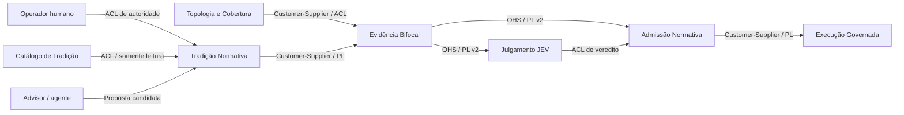

# Context Map — Harness Perfeito v2

**Domínio:** `harness_perfect_v2`  
**Projeto:** `codebase-memory-multigraph-mcp`  
**Data:** 2026-10-09

## 1. Bounded Contexts

A [Linguagem Ubíqua de 001](001-problem-space.md) governa os nomes abaixo. Contextos são fronteiras de modelo e responsabilidade dentro do monólito modular C11; não exigem novos serviços ou processos. A propriedade por equipe é uma responsabilidade lógica proposta, sem pressupor equipes existentes.

| Contexto | Responsabilidade | Fronteira: o que fica excluído | Propriedade lógica | Entidades/agregados-chave |
|---|---|---|---|---|
| Topologia e Cobertura | Publicar gerações de símbolos, relações e lacunas verificáveis. | Julgamento JEV, aprovação de normas e armazenamento do ledger durável. | Mantenedores do pipeline/store | Geração Topológica, Snapshot de Evidência |
| Evidência Bifocal | Produzir Bundle de Evidência consistente e selado para um escopo. | Mutação do código, prova semântica de integrações e promoção normativa. | Mantenedores do extrator | Bundle de Evidência, Alvo de Mutação, Cápsula de Dependência, Mapa de Costuras |
| Tradição Normativa | Manter regras e vínculos locais, autoridade de aprovação e cadência de revisão. | Escrita no catálogo coletivo externo, julgamento de uma mudança e rebuild do grafo. | Governança CBM e operador humano | Regra de Tradição, Cadência de Revisão, Revisão Normativa |
| Admissão Normativa | Avaliar Fast-Path e registrar Manifesto de Admissão com integridade temporal. | Algoritmo de pontuação JEV e execução de mudanças no repositório. | Mantenedores de admission | Avaliação de Fast-Path, Manifesto de Admissão |
| Julgamento JEV — externo | Julgar a mudança e a evidência contra as normas aplicáveis. | Administração dos bancos CBM e concessão de autoridade humana. | Integradores JEV | Veredito JEV |
| Execução Governada — existente/externo à evolução | Aplicar gates de efeitos, sessão, contestação e âncoras antes da mutação. | Extração bifocal e criação de regras aprovadas. | Mantenedores de union/admission e host | Sessão, Contrato, Âncora, Contestação |
| Catálogo de Tradição — externo | Publicar versões de cânones coletivos para consulta e vinculação. | Persistência de propostas locais e admissão do projeto. | Curadores externos | Tema, Versão de Cânone |

Projeção de Costuras é um subdomínio Supporting alojado no contexto Evidência Bifocal: sua saída precisa do mesmo snapshot, identidade de símbolos e proveniência. Transporte MCP e persistência são adaptadores Generic, não contextos de negócio autônomos.

## 2. Context Map e contratos

Na tabela, U é upstream, produtor do contrato; D é downstream, consumidor. A direção expressa dependência do modelo, não necessariamente a ordem de chamadas.

| Relação U → D | Padrões | Contrato e tradução | Justificativa e falhas |
|---|---|---|---|
| Topologia e Cobertura → Evidência Bifocal | Customer-Supplier + ACL | Leitura fixada de geração, relações paginadas e cobertura; ACL converte status do indexador em `clean/partial/missed`. | Extrator demanda identidade e lacunas do fornecedor; parsing incompleto permanece explícito. |
| Tradição Normativa → Evidência Bifocal | Customer-Supplier + Published Language (PL) | Regras aplicáveis, força, estado efetivo, revisão e proveniência. | Bundle exige versão estável; candidatos não se tornam normas por consumo. |
| Evidência Bifocal → Admissão Normativa | OHS/PL interno | `HarnessEvidenceBundle v2`, hashes e metadados canônicos. | Avaliador usa contrato versionado; payload inconsistente resulta em recusa. |
| Evidência Bifocal → Julgamento JEV | Open Host Service (OHS) + PL | `mcp_cbm_extract_harness_bundle`; linguagem JSON canônica v2. | Múltiplos clientes consomem evidência estável sem acesso direto ao banco. |
| Admissão Normativa → Orquestrador/JEV | OHS + PL | `mcp_cbm_evaluate_fast_path` e `mcp_cbm_record_admission_manifest`, com recusas estruturadas. | Elegibilidade e persistência são serviços distintos; erros não viram permissões. |
| Julgamento JEV → Admissão Normativa | ACL | Veredito recebido pelo endpoint de registro: score finito, arrays validados, hashes e escopo. | CBM não confia em booleanos enviados para contornar condições locais; não reproduz o algoritmo JEV. |
| Advisor/agente → Tradição Normativa | ACL na entrada + OHS/PL do receptor | `mcp_cbm_tradition_propose` traduz a proposta para candidata, ignorando qualquer pretensão de aprovação. | Sem confiança transitiva entre aconselhamento e autoridade normativa. |
| Operador humano → Tradição Normativa | ACL de autoridade | Canal de operador confiável aprova/revisa; credencial vem do host e não do JSON MCP do agente. | As quatro ferramentas novas não oferecem promoção. |
| Catálogo de Tradição → Tradição Normativa | ACL + PL | Referências a cânones/versões entram como vínculos locais com proveniência. | ADR-002 mantém catálogo externo somente leitura; aprovação local não publica tema coletivo. |
| Admissão Normativa → Execução Governada | Customer-Supplier + PL | Manifesto durável consultável por ID/hash; gate valida vínculo com mudança e snapshot. | Ledger suporta a execução; não substitui sessão, whitelist, contestação ou âncoras. |
| Topologia e Cobertura ↔ Tradição Normativa | Separate Ways para armazenamento | Grafo reconstruível e governança durável têm arquivos e ciclos de manutenção separados. | Não há cópia destrutiva de regras durante rebuild; integração de revisão ocorre pelo snapshot coordenado, não por tabelas do grafo. |
| Evidência Bifocal ↔ Kafka/Celery em runtime | Separate Ways | Apenas código/configuração observados; não há produtor/consumidor runtime implementado pelo CBM. | Kafka → Celery é uma hipótese tipada do Mapa de Costuras, não uma integração ativa. |

Separate Ways aplica-se às responsabilidades descritas, sem negar as integrações entre evidência, normas e snapshot. OHS e PL são complementares: serviço de acesso estável mais linguagem versionada. Não há Shared Kernel de entidades mutáveis entre os contextos; IDs e DTOs publicados são contratos, não propriedade compartilhada dos agregados.

## 3. Core Domain e investimento

| Contexto Core | Razão | Investimento tático justificado |
|---|---|---|
| Evidência Bifocal | A assimetria conserva fidelidade para mutação enquanto controla o custo contextual. | Modelo imutável do bundle, extração AST delimitada, efeitos conservadores, canonicalização determinística e benchmark de payload. |
| Tradição Normativa | A validade de uma regra depende de autoridade e revisão, não da confiança do agente. | Máquina de estados explícita, cadência, proveniência, revisão transacional e testes de tentativa de autopromoção. |
| Admissão Normativa | A decisão só é válida para a evidência realmente julgada. | Fail-closed, fence de publicação, revalidação do snapshot, idempotência e ledger durável. |

Topologia e Cobertura e Projeção de Costuras permanecem Supporting, conforme 001. SQLite, Tree-sitter, yyjson e MCP são mecanismos reutilizados; não se cria uma infraestrutura distribuída para representar essas fronteiras.

## 4. Decisões estratégicas de integração

### D-01 — Publicar linguagem de evidência versionada

**Decisão:** OHS MCP publica `HarnessEvidenceBundle v2` e respostas estruturadas; consumidores não acessam tabelas internas.  
**Contexto:** JEV e Advisor precisam da mesma evidência sem acoplamento ao layout C/SQLite.  
**Consequências:** hashes e compatibilidade são testáveis; versão desconhecida é recusada e exige evolução explícita do contrato.

### D-02 — Separar autoridade de aconselhamento

**Decisão:** toda proposta do agente é candidata; aprovação/revisão requer canal humano confiável fora das quatro ferramentas novas.  
**Contexto:** ADR-004 restringe a promoção; ADR-002 preserva a propriedade do cânone externo.  
**Consequências:** não há autopromoção nem publicação externa implícita; implantação deve oferecer um adaptador humano autenticado antes de habilitar promoção.

### D-03 — Isolar armazenamento durável e coordenar snapshot

**Decisão:** `governance.db` separado do arquivo de grafo, conexão gerenciada dedicada WAL/FULL e fence de publicação/admissão por projeto entre processos.  
**Contexto:** `pipeline.c` substitui a geração preparada; um lock SQLite local não protege o arquivo de outro banco.  
**Consequências:** ledger sobrevive aos swaps; exige protocolo de publicação recuperável e bloqueio de admissão durante recuperação, detalhado em 003.

### D-04 — Preservar a diferença entre hipótese e fato

**Decisão:** `seam_map` mantém tipos, proveniência e `unverified_hypothesis`; `effect_fingerprint` usa tri-state conservador.  
**Contexto:** AST não resolve toda integração ou despacho dinâmico.  
**Consequências:** evita falsa liberação e aumenta revisões completas; enriquecimento futuro não transforma hipótese em fato silenciosamente.

### D-05 — Separar elegibilidade, julgamento e execução

**Decisão:** Fast-Path é decisão estrutural, JEV é decisão de conformidade e manifesto é registro pré-execução.  
**Contexto:** pontuação alta ou coverage `clean` não substitui regras e gates.  
**Consequências:** ledger aceita somente veredito sem bloqueios e snapshot vigente; execução mantém suas invariantes existentes.

## 5. Base arquitetural e evidência da inspeção

Fontes: [ADR-004](../../adr/ADR-004-HARNESS-PERFEITO-V2.md), [registro de ADRs](../../../ADR.md), [arquitetura](../../adr/ARCHITECTURE.md), [ADR-002](../../adr/ADR-002-THREE-TERRITORIES.md), [ADR-003](../../adr/ADR-003-TWO-TIER-ANCHORS.md) e [protocolo de testes](../../adr/TESTS.md).

A verificação Tier 2 consultou o projeto do grafo `C-Users-User-Documents-codebase-memory-multigraph-mcp`. A cobertura registrou geração `2026-10-09T16:42:40Z`, com metadados alterados; o digest documental indicava geração antiga de 2026-10-01 e não foi tratado como retrato atual completo. `cbm_pipeline_finalize_staged_generation` foi lido no grafo e diretamente no arquivo: publica via substituição de arquivo. O trace de profundidade 1, nas duas direções, retornou uma página completa, incluindo `cbm_pipeline_publish_staged` como chamador. `cbm_mcp_handle_tool` foi verificado como fronteira de dispatch/liberação por requisição. `cbm_horizon_pool_get` foi lido diretamente e configura `synchronous=NORMAL`; por isso a conexão de governança exige perfil separado FULL.

As lacunas reportadas foram lidas diretamente: `pipeline.c` linhas 247–248 e `mcp.c` linhas 189, 199, 4565, 4711, 6916, 6992, 7734, 8375, 8955, 10173, 12468 e 17243. Elas incluem macros TLS/iterações yyjson. A inspeção sustenta os pontos de integração mencionados; não afirma completude do grafo nem ausência exaustiva de funcionalidades existentes. Os módulos novos em 003 são propostas de implementação, não arquivos existentes verificados.
